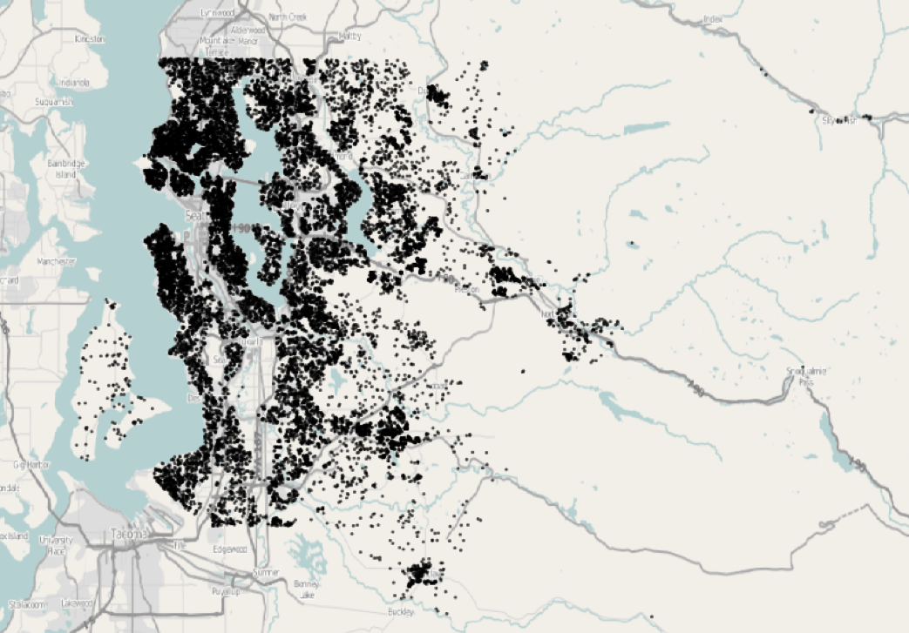

# Predicting Selling Price of Homes In King County, WA

The data for these sales comes from the official public records of home sales in the King County area, Washington State. 
The data set contains 21,606 homes that sold between May 2014 and May 2015. The table below gives variable names and descriptions. The map below shows the location of all 21,606 homes you will be working with.

The data and funcitons in mult.Rdata, Regression.Rdata are provided by Dr. Brant Deppa.

## Variables in King County, WA Datasets

- ID – id number 
- price - Price of each home sold 
- bedrooms - Number of bedrooms
- bathrooms - Number of bathrooms, where .5 accounts for a room with a toilet but no shower.
- sqft_living - Square footage of the apartments interior living space.
- sqft_lot - Square footage of the land space.
- floors - Number of floors.
- waterfront - A categorical variable for whether the apartment/home was overlooking the waterfront or not (1 = yes, 0 = no).
- view - An ordinal index from 0 to 4 of how good the view of the property has.
- condition - An index from 1 to 5 on the condition of the apartment.
- grade - An ordinal index from 1 to 13, where 1-3 falls short of building construction and design, 7 has an average level of construction and design, and 11-13 have a high quality level of construction and design.  Other intermediary values indicate conditions in between these descriptors.
- sqft_above - The square footage of the interior housing space that is above ground level.
- sqft_basement - The square footage of the interior housing space that is below ground level. 
- yr_built - The year the house was initially built. 
- yr_renovated - The year of the house’s last renovation, 0 indicates it has not been renovated.
- renovated – indicator of whether or not the home has been renovated (1 = yes, 0 = no)
- zipcode – ZIP code area the house is in  (Note: ZIP codes are NOT numeric!)
- lat - Lattitude of the home
- long - Longitude of the home
- sqft_living15 - The mean square footage of the interior living space of the nearest fifteen neighbouring homes.
- sqft_lot15 - The mean square footage of the land lots of the nearest fifteen neighbouring homes.

