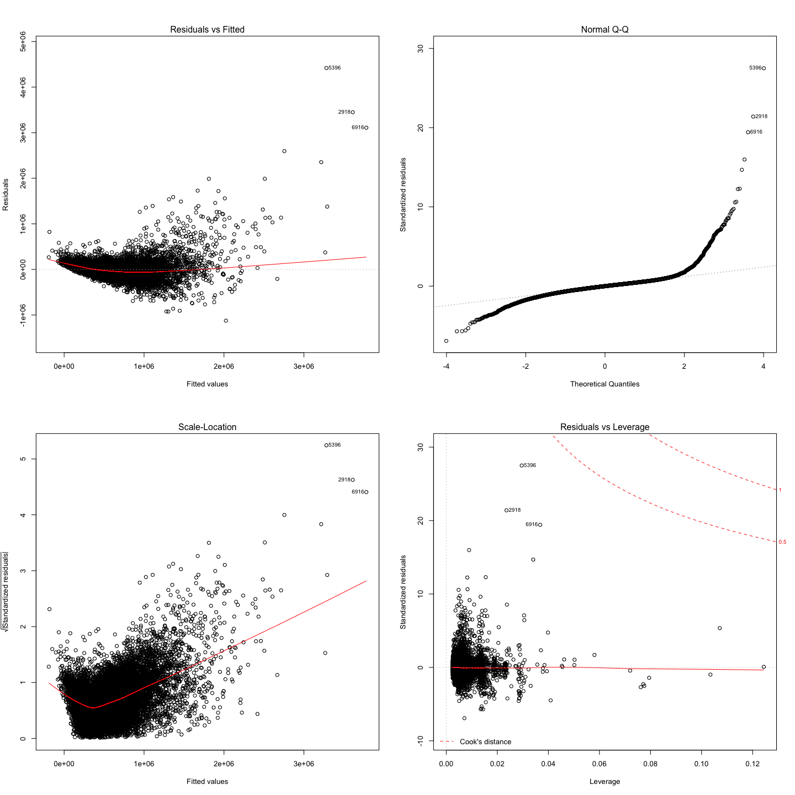
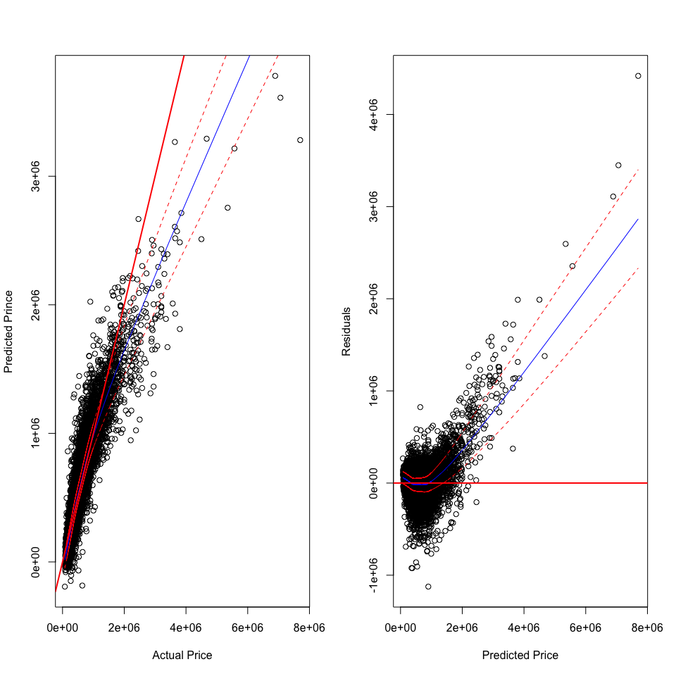
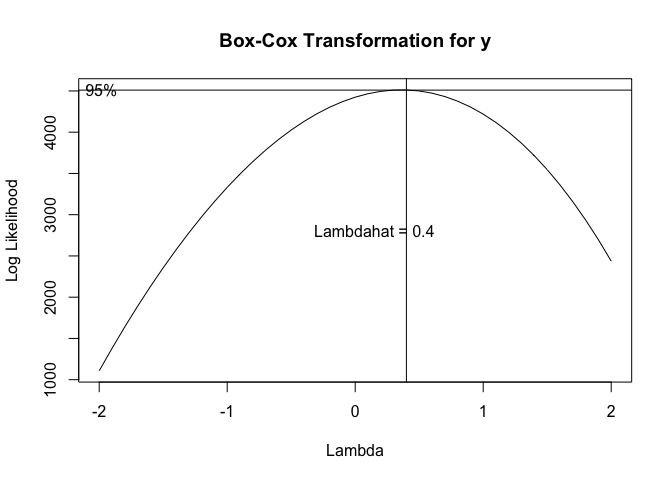
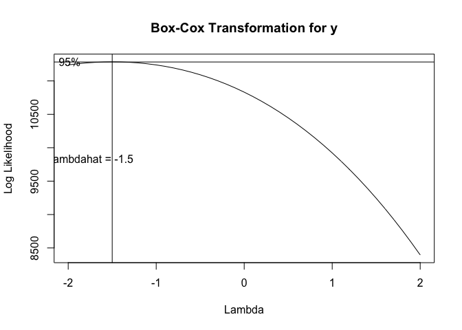

# Multiple-Linear-Regression

``` r
#Load the .Rdata
library(car)
```

    ## Loading required package: carData

``` r
load("~/OneDrive - MNSCU/myGithub/Statistics/Regression_models/Multiple_Linear_Regression/Multiple-Linear-Regression/mult.Rdata")
load("~/OneDrive - MNSCU/myGithub/Statistics/Regression_models/Multiple_Linear_Regression/Multiple-Linear-Regression/Regression.Rdata")
```

Data
====

The data for these sales comes from the official public records of home
sales in the King County area, Washington State. The data set contains
21,606 homes that sold between May 2014 and May 2015. Load the train and
test data sets. The description of all variables is in the data section.

``` r
KingTest = read.csv(file = "King County Homes (test).csv")
King = read.csv("King County Homes (train).csv")
```

``` r
str(King)
```

    ## 'data.frame':    16187 obs. of  21 variables:
    ##  $ ID           : int  1 2 3 4 5 6 7 8 9 10 ...
    ##  $ price        : int  221900 538000 180000 510000 1230000 257500 291850 229500 323000 662500 ...
    ##  $ bedrooms     : int  3 3 2 3 4 3 3 3 3 3 ...
    ##  $ bathrooms    : num  1 2.25 1 2 4.5 2.25 1.5 1 2.5 2.5 ...
    ##  $ sqft_living  : int  1180 2570 770 1680 5420 1715 1060 1780 1890 3560 ...
    ##  $ sqft_lot     : int  5650 7242 10000 8080 101930 6819 9711 7470 6560 9796 ...
    ##  $ floors       : num  1 2 1 1 1 2 1 1 2 1 ...
    ##  $ waterfront   : int  0 0 0 0 0 0 0 0 0 0 ...
    ##  $ view         : int  0 0 0 0 0 0 0 0 0 0 ...
    ##  $ condition    : int  3 3 3 3 3 3 3 3 3 3 ...
    ##  $ grade        : int  7 7 6 8 11 7 7 7 7 8 ...
    ##  $ sqft_above   : int  1180 2170 770 1680 3890 1715 1060 1050 1890 1860 ...
    ##  $ sqft_basement: int  0 400 0 0 1530 0 0 730 0 1700 ...
    ##  $ yr_built     : int  1955 1951 1933 1987 2001 1995 1963 1960 2003 1965 ...
    ##  $ yr_renovated : int  0 1991 0 0 0 0 0 0 0 0 ...
    ##  $ renovated    : int  0 1 0 0 0 0 0 0 0 0 ...
    ##  $ zipcode      : int  98178 98125 98028 98074 98053 98003 98198 98146 98038 98007 ...
    ##  $ lat          : num  47.5 47.7 47.7 47.6 47.7 ...
    ##  $ long         : num  -122 -122 -122 -122 -122 ...
    ##  $ sqft_living15: int  1340 1690 2720 1800 4760 2238 1650 1780 2390 2210 ...
    ##  $ sqft_lot15   : int  5650 7639 8062 7503 101930 6819 9711 8113 7570 8925 ...

``` r
summary(King)
```

    ##        ID            price            bedrooms        bathrooms    
    ##  Min.   :    1   Min.   :  75000   Min.   : 0.000   Min.   :0.000  
    ##  1st Qu.: 4048   1st Qu.: 324624   1st Qu.: 3.000   1st Qu.:1.750  
    ##  Median : 8094   Median : 451000   Median : 3.000   Median :2.250  
    ##  Mean   : 8094   Mean   : 542802   Mean   : 3.374   Mean   :2.117  
    ##  3rd Qu.:12140   3rd Qu.: 648876   3rd Qu.: 4.000   3rd Qu.:2.500  
    ##  Max.   :16187   Max.   :7700000   Max.   :33.000   Max.   :8.000  
    ##   sqft_living       sqft_lot           floors        waterfront      
    ##  Min.   :  370   Min.   :    520   Min.   :1.000   Min.   :0.000000  
    ##  1st Qu.: 1420   1st Qu.:   5040   1st Qu.:1.000   1st Qu.:0.000000  
    ##  Median : 1920   Median :   7600   Median :1.500   Median :0.000000  
    ##  Mean   : 2084   Mean   :  15069   Mean   :1.495   Mean   :0.007599  
    ##  3rd Qu.: 2550   3rd Qu.:  10696   3rd Qu.:2.000   3rd Qu.:0.000000  
    ##  Max.   :12050   Max.   :1651359   Max.   :3.500   Max.   :1.000000  
    ##       view          condition         grade          sqft_above  
    ##  Min.   :0.0000   Min.   :1.000   Min.   : 3.000   Min.   : 370  
    ##  1st Qu.:0.0000   1st Qu.:3.000   1st Qu.: 7.000   1st Qu.:1190  
    ##  Median :0.0000   Median :3.000   Median : 7.000   Median :1560  
    ##  Mean   :0.2435   Mean   :3.409   Mean   : 7.661   Mean   :1791  
    ##  3rd Qu.:0.0000   3rd Qu.:4.000   3rd Qu.: 8.000   3rd Qu.:2220  
    ##  Max.   :4.0000   Max.   :5.000   Max.   :13.000   Max.   :8860  
    ##  sqft_basement       yr_built     yr_renovated       renovated     
    ##  Min.   :   0.0   Min.   :1900   Min.   :   0.00   Min.   :0.0000  
    ##  1st Qu.:   0.0   1st Qu.:1951   1st Qu.:   0.00   1st Qu.:0.0000  
    ##  Median :   0.0   Median :1975   Median :   0.00   Median :0.0000  
    ##  Mean   : 292.9   Mean   :1971   Mean   :  83.24   Mean   :0.0417  
    ##  3rd Qu.: 570.0   3rd Qu.:1997   3rd Qu.:   0.00   3rd Qu.:0.0000  
    ##  Max.   :4820.0   Max.   :2015   Max.   :2015.00   Max.   :1.0000  
    ##     zipcode           lat             long        sqft_living15 
    ##  Min.   :98001   Min.   :47.16   Min.   :-122.5   Min.   : 399  
    ##  1st Qu.:98033   1st Qu.:47.47   1st Qu.:-122.3   1st Qu.:1490  
    ##  Median :98065   Median :47.57   Median :-122.2   Median :1840  
    ##  Mean   :98078   Mean   :47.56   Mean   :-122.2   Mean   :1990  
    ##  3rd Qu.:98118   3rd Qu.:47.68   3rd Qu.:-122.1   3rd Qu.:2370  
    ##  Max.   :98199   Max.   :47.78   Max.   :-121.3   Max.   :6210  
    ##    sqft_lot15    
    ##  Min.   :   651  
    ##  1st Qu.:  5100  
    ##  Median :  7601  
    ##  Mean   : 12678  
    ##  3rd Qu.: 10080  
    ##  Max.   :871200

Explore factor and ordinal variables

``` r
#Factor variables: 
#waterfront (dummy), renovated(dummy), zipcode
#Ordinal variables:
#view (0-4), condition (1-5), grade (1-13), 
King$waterfront = as.factor(King$waterfront)
King$renovated= as.factor(King$renovated)
King$zipcode = as.factor(King$zipcode)
summary(King)
```

    ##        ID            price            bedrooms        bathrooms    
    ##  Min.   :    1   Min.   :  75000   Min.   : 0.000   Min.   :0.000  
    ##  1st Qu.: 4048   1st Qu.: 324624   1st Qu.: 3.000   1st Qu.:1.750  
    ##  Median : 8094   Median : 451000   Median : 3.000   Median :2.250  
    ##  Mean   : 8094   Mean   : 542802   Mean   : 3.374   Mean   :2.117  
    ##  3rd Qu.:12140   3rd Qu.: 648876   3rd Qu.: 4.000   3rd Qu.:2.500  
    ##  Max.   :16187   Max.   :7700000   Max.   :33.000   Max.   :8.000  
    ##                                                                    
    ##   sqft_living       sqft_lot           floors      waterfront
    ##  Min.   :  370   Min.   :    520   Min.   :1.000   0:16064   
    ##  1st Qu.: 1420   1st Qu.:   5040   1st Qu.:1.000   1:  123   
    ##  Median : 1920   Median :   7600   Median :1.500             
    ##  Mean   : 2084   Mean   :  15069   Mean   :1.495             
    ##  3rd Qu.: 2550   3rd Qu.:  10696   3rd Qu.:2.000             
    ##  Max.   :12050   Max.   :1651359   Max.   :3.500             
    ##                                                              
    ##       view          condition         grade          sqft_above  
    ##  Min.   :0.0000   Min.   :1.000   Min.   : 3.000   Min.   : 370  
    ##  1st Qu.:0.0000   1st Qu.:3.000   1st Qu.: 7.000   1st Qu.:1190  
    ##  Median :0.0000   Median :3.000   Median : 7.000   Median :1560  
    ##  Mean   :0.2435   Mean   :3.409   Mean   : 7.661   Mean   :1791  
    ##  3rd Qu.:0.0000   3rd Qu.:4.000   3rd Qu.: 8.000   3rd Qu.:2220  
    ##  Max.   :4.0000   Max.   :5.000   Max.   :13.000   Max.   :8860  
    ##                                                                  
    ##  sqft_basement       yr_built     yr_renovated     renovated
    ##  Min.   :   0.0   Min.   :1900   Min.   :   0.00   0:15512  
    ##  1st Qu.:   0.0   1st Qu.:1951   1st Qu.:   0.00   1:  675  
    ##  Median :   0.0   Median :1975   Median :   0.00            
    ##  Mean   : 292.9   Mean   :1971   Mean   :  83.24            
    ##  3rd Qu.: 570.0   3rd Qu.:1997   3rd Qu.:   0.00            
    ##  Max.   :4820.0   Max.   :2015   Max.   :2015.00            
    ##                                                             
    ##     zipcode           lat             long        sqft_living15 
    ##  98103  :  457   Min.   :47.16   Min.   :-122.5   Min.   : 399  
    ##  98052  :  446   1st Qu.:47.47   1st Qu.:-122.3   1st Qu.:1490  
    ##  98115  :  442   Median :47.57   Median :-122.2   Median :1840  
    ##  98038  :  437   Mean   :47.56   Mean   :-122.2   Mean   :1990  
    ##  98117  :  432   3rd Qu.:47.68   3rd Qu.:-122.1   3rd Qu.:2370  
    ##  98034  :  403   Max.   :47.78   Max.   :-121.3   Max.   :6210  
    ##  (Other):13570                                                  
    ##    sqft_lot15    
    ##  Min.   :   651  
    ##  1st Qu.:  5100  
    ##  Median :  7601  
    ##  Mean   : 12678  
    ##  3rd Qu.: 10080  
    ##  Max.   :871200  
    ## 

First, we are going to fit a base model and discuss any deficiencies.

``` r
names(King)
```

    ##  [1] "ID"            "price"         "bedrooms"      "bathrooms"    
    ##  [5] "sqft_living"   "sqft_lot"      "floors"        "waterfront"   
    ##  [9] "view"          "condition"     "grade"         "sqft_above"   
    ## [13] "sqft_basement" "yr_built"      "yr_renovated"  "renovated"    
    ## [17] "zipcode"       "lat"           "long"          "sqft_living15"
    ## [21] "sqft_lot15"

``` r
#remove ID variable to only have y and x's df
King_clean = King[,-1]
```

Fit a full model:

``` r
lm1.king = lm(price~., data = King_clean)
summary(lm1.king)
```

    ## 
    ## Call:
    ## lm(formula = price ~ ., data = King_clean)
    ## 
    ## Residuals:
    ##      Min       1Q   Median       3Q      Max 
    ## -1124012   -70633     -466    62572  4418822 
    ## 
    ## Coefficients: (1 not defined because of singularities)
    ##                 Estimate Std. Error t value Pr(>|t|)    
    ## (Intercept)   -2.459e+07  7.498e+06  -3.279 0.001043 ** 
    ## bedrooms      -2.596e+04  1.765e+03 -14.706  < 2e-16 ***
    ## bathrooms      2.022e+04  3.104e+03   6.515 7.47e-11 ***
    ## sqft_living    1.311e+02  4.155e+00  31.541  < 2e-16 ***
    ## sqft_lot       2.593e-01  4.358e-02   5.950 2.74e-09 ***
    ## floors        -4.435e+04  3.692e+03 -12.012  < 2e-16 ***
    ## waterfront1    5.987e+05  1.656e+04  36.143  < 2e-16 ***
    ## view           5.906e+04  2.018e+03  29.266  < 2e-16 ***
    ## condition      2.727e+04  2.266e+03  12.036  < 2e-16 ***
    ## grade          5.648e+04  2.126e+03  26.567  < 2e-16 ***
    ## sqft_above     8.105e+01  4.241e+00  19.109  < 2e-16 ***
    ## sqft_basement         NA         NA      NA       NA    
    ## yr_built      -6.508e+02  7.620e+01  -8.541  < 2e-16 ***
    ## yr_renovated   2.677e+03  4.031e+02   6.641 3.21e-11 ***
    ## renovated1    -5.306e+06  8.046e+05  -6.594 4.41e-11 ***
    ## zipcode98002   3.763e+04  1.740e+04   2.163 0.030559 *  
    ## zipcode98003  -2.297e+04  1.522e+04  -1.509 0.131336    
    ## zipcode98004   7.296e+05  2.761e+04  26.423  < 2e-16 ***
    ## zipcode98005   2.561e+05  2.959e+04   8.655  < 2e-16 ***
    ## zipcode98006   2.304e+05  2.433e+04   9.471  < 2e-16 ***
    ## zipcode98007   2.079e+05  3.056e+04   6.804 1.05e-11 ***
    ## zipcode98008   2.123e+05  2.907e+04   7.304 2.93e-13 ***
    ## zipcode98010   1.043e+05  2.606e+04   4.002 6.30e-05 ***
    ## zipcode98011   4.858e+04  3.764e+04   1.291 0.196867    
    ## zipcode98014   7.535e+04  4.144e+04   1.818 0.069081 .  
    ## zipcode98019   5.665e+04  4.145e+04   1.367 0.171764    
    ## zipcode98022   4.451e+04  2.294e+04   1.941 0.052309 .  
    ## zipcode98023  -4.331e+04  1.415e+04  -3.061 0.002207 ** 
    ## zipcode98024   1.440e+05  3.734e+04   3.858 0.000115 ***
    ## zipcode98027   1.586e+05  2.515e+04   6.307 2.91e-10 ***
    ## zipcode98028   4.009e+04  3.669e+04   1.093 0.274503    
    ## zipcode98029   2.032e+05  2.885e+04   7.043 1.96e-12 ***
    ## zipcode98030   7.758e+03  1.660e+04   0.467 0.640263    
    ## zipcode98031   8.761e+03  1.738e+04   0.504 0.614177    
    ## zipcode98032  -7.291e+03  2.060e+04  -0.354 0.723411    
    ## zipcode98033   3.013e+05  3.151e+04   9.562  < 2e-16 ***
    ## zipcode98034   1.321e+05  3.376e+04   3.913 9.16e-05 ***
    ## zipcode98038   5.099e+04  1.925e+04   2.649 0.008091 ** 
    ## zipcode98039   1.239e+06  3.770e+04  32.879  < 2e-16 ***
    ## zipcode98040   4.664e+05  2.450e+04  19.034  < 2e-16 ***
    ## zipcode98042   1.791e+04  1.623e+04   1.103 0.269951    
    ## zipcode98045   1.379e+05  3.615e+04   3.814 0.000137 ***
    ## zipcode98052   1.797e+05  3.218e+04   5.583 2.40e-08 ***
    ## zipcode98053   1.544e+05  3.473e+04   4.446 8.81e-06 ***
    ## zipcode98055   3.497e+04  1.940e+04   1.803 0.071455 .  
    ## zipcode98056   7.238e+04  2.119e+04   3.416 0.000636 ***
    ## zipcode98058   1.925e+04  1.850e+04   1.041 0.297961    
    ## zipcode98059   6.595e+04  2.079e+04   3.173 0.001514 ** 
    ## zipcode98065   9.321e+04  3.276e+04   2.845 0.004451 ** 
    ## zipcode98070  -6.463e+04  2.414e+04  -2.677 0.007434 ** 
    ## zipcode98072   7.629e+04  3.766e+04   2.026 0.042801 *  
    ## zipcode98074   1.423e+05  3.069e+04   4.638 3.54e-06 ***
    ## zipcode98075   1.453e+05  2.956e+04   4.915 8.98e-07 ***
    ## zipcode98077   6.125e+04  3.923e+04   1.561 0.118440    
    ## zipcode98092  -2.225e+04  1.524e+04  -1.460 0.144308    
    ## zipcode98102   4.492e+05  3.229e+04  13.911  < 2e-16 ***
    ## zipcode98103   2.664e+05  3.043e+04   8.754  < 2e-16 ***
    ## zipcode98105   4.127e+05  3.123e+04  13.214  < 2e-16 ***
    ## zipcode98106   1.110e+05  2.261e+04   4.911 9.15e-07 ***
    ## zipcode98107   2.729e+05  3.135e+04   8.703  < 2e-16 ***
    ## zipcode98108   8.321e+04  2.530e+04   3.289 0.001008 ** 
    ## zipcode98109   4.491e+05  3.233e+04  13.889  < 2e-16 ***
    ## zipcode98112   5.743e+05  2.856e+04  20.106  < 2e-16 ***
    ## zipcode98115   2.659e+05  3.087e+04   8.613  < 2e-16 ***
    ## zipcode98116   2.322e+05  2.512e+04   9.243  < 2e-16 ***
    ## zipcode98117   2.373e+05  3.126e+04   7.592 3.31e-14 ***
    ## zipcode98118   1.371e+05  2.196e+04   6.242 4.42e-10 ***
    ## zipcode98119   4.235e+05  3.058e+04  13.849  < 2e-16 ***
    ## zipcode98122   2.727e+05  2.727e+04  10.000  < 2e-16 ***
    ## zipcode98125   1.266e+05  3.333e+04   3.798 0.000146 ***
    ## zipcode98126   1.420e+05  2.304e+04   6.164 7.24e-10 ***
    ## zipcode98133   8.428e+04  3.440e+04   2.450 0.014291 *  
    ## zipcode98136   1.938e+05  2.360e+04   8.212 2.35e-16 ***
    ## zipcode98144   2.283e+05  2.520e+04   9.060  < 2e-16 ***
    ## zipcode98146   6.979e+04  2.107e+04   3.312 0.000927 ***
    ## zipcode98148   4.653e+04  2.834e+04   1.642 0.100614    
    ## zipcode98155   6.006e+04  3.581e+04   1.677 0.093543 .  
    ## zipcode98166   1.865e+04  1.945e+04   0.959 0.337491    
    ## zipcode98168   4.651e+04  2.018e+04   2.305 0.021195 *  
    ## zipcode98177   1.281e+05  3.577e+04   3.581 0.000343 ***
    ## zipcode98178   1.560e+04  2.103e+04   0.742 0.458127    
    ## zipcode98188   2.183e+04  2.156e+04   1.013 0.311205    
    ## zipcode98198  -1.695e+04  1.626e+04  -1.043 0.297182    
    ## zipcode98199   3.024e+05  2.979e+04  10.151  < 2e-16 ***
    ## lat            1.941e+05  7.469e+04   2.599 0.009364 ** 
    ## long          -1.322e+05  5.628e+04  -2.349 0.018846 *  
    ## sqft_living15  9.624e+00  3.372e+00   2.855 0.004314 ** 
    ## sqft_lot15    -1.003e-01  6.933e-02  -1.447 0.147887    
    ## ---
    ## Signif. codes:  0 '***' 0.001 '**' 0.01 '*' 0.05 '.' 0.1 ' ' 1
    ## 
    ## Residual standard error: 163100 on 16100 degrees of freedom
    ## Multiple R-squared:  0.8063, Adjusted R-squared:  0.8052 
    ## F-statistic: 779.1 on 86 and 16100 DF,  p-value: < 2.2e-16

Comparative boxplots to examine the relationship between
categorical/ordinal predictors and a numeric response (Price)

``` r
boxplot(price~waterfront, data = King_clean, main = "Price by Waterfront")
```


``` r
boxplot(price~renovated, data = King_clean, main = "Price by Renovated")
```


``` r
boxplot(price~zipcode, data = King_clean, main = "Price by Zipcode")
```


The relationship of predictor & response is only looked at on individual
basis, not in the lm1.king model. We do not know how those predictors
will be behaving together in that model.

``` r
names(King_clean)
```

    ##  [1] "price"         "bedrooms"      "bathrooms"     "sqft_living"  
    ##  [5] "sqft_lot"      "floors"        "waterfront"    "view"         
    ##  [9] "condition"     "grade"         "sqft_above"    "sqft_basement"
    ## [13] "yr_built"      "yr_renovated"  "renovated"     "zipcode"      
    ## [17] "lat"           "long"          "sqft_living15" "sqft_lot15"

Let’s plot the model to look at residuals.

``` r
par(mfrow=c(2,2))
plot(lm1.king)  
```

 Residuals
vs. Fitted: we are looking whether there is a constant variance and
whether there is a curvature my model is missing. We can see that the
data points are not distributed with approximately similar vertical
distances - the model is not homoskedastic. There also seems to be some
curvature present that this model is not addressing.

Normal Quantile plot shows that the data does not follow the normal
distribution.

Residuals vs Leverage: data points to the very right may have big
leverage and be “pulling” (affecting) the rest of the model. Some log
transformations could maybe fix this issue.

We are running vif(lm1.king) function from the car package to check the
variance inflation factor; the value larger than 10 would indicate that
our model is facing multicollinearity concerns. We are getting an error
message talking about aliased coefficients in the model. It means that
there is perfect multicollinearity present. Perfect multicollinearity
means that some predictors are perfectly correlated with one another (+1
or -1). These might be caused by sqft\_above and sqft\_basement
predictors as they are perfect opposites of each other.

Extracting fitted/predicted values and then plot actual vs. predicted.

``` r
y = King_clean$price
yhat = predict(lm1.king, data = King_clean)
ehat = resid(lm1.king)
ehat = y - yhat
```

We will not plot Actual vs. Predicted and Residuals vs. Predicted Price
plots. The trendscat() function will add +/- SD bounds on the graph.

``` r
par(mfrow=c(1,2))
trendscat(y,yhat, xlab = "Actual Price", ylab = "Predicted Prince")
abline(0,1, lwd = 2, col = "red")
trendscat(y, ehat, xlab = "Predicted Price", ylab = "Residuals")
abline(h = 0, lwd = 2, col = "red")
```

 The current
model does not predict the price so well.

Backward Elimination
--------------------

We are going to use stepwise reduciton model to simplify it.

``` r
#Backward Elimination
back.king = step(lm1.king, direction = "backward")
```

    ## Start:  AIC=388648.5
    ## price ~ bedrooms + bathrooms + sqft_living + sqft_lot + floors + 
    ##     waterfront + view + condition + grade + sqft_above + sqft_basement + 
    ##     yr_built + yr_renovated + renovated + zipcode + lat + long + 
    ##     sqft_living15 + sqft_lot15
    ## 
    ## 
    ## Step:  AIC=388648.5
    ## price ~ bedrooms + bathrooms + sqft_living + sqft_lot + floors + 
    ##     waterfront + view + condition + grade + sqft_above + yr_built + 
    ##     yr_renovated + renovated + zipcode + lat + long + sqft_living15 + 
    ##     sqft_lot15
    ## 
    ##                 Df  Sum of Sq        RSS    AIC
    ## <none>                        4.2842e+14 388649
    ## - sqft_lot15     1 5.5725e+10 4.2848e+14 388649
    ## - long           1 1.4681e+11 4.2857e+14 388652
    ## - lat            1 1.7972e+11 4.2860e+14 388653
    ## - sqft_living15  1 2.1684e+11 4.2864e+14 388655
    ## - sqft_lot       1 9.4192e+11 4.2937e+14 388682
    ## - bathrooms      1 1.1296e+12 4.2955e+14 388689
    ## - renovated      1 1.1571e+12 4.2958e+14 388690
    ## - yr_renovated   1 1.1736e+12 4.2960e+14 388691
    ## - yr_built       1 1.9413e+12 4.3036e+14 388720
    ## - floors         1 3.8396e+12 4.3226e+14 388791
    ## - condition      1 3.8549e+12 4.3228e+14 388792
    ## - bedrooms       1 5.7550e+12 4.3418e+14 388863
    ## - sqft_above     1 9.7169e+12 4.3814e+14 389010
    ## - grade          1 1.8781e+13 4.4720e+14 389341
    ## - view           1 2.2792e+13 4.5121e+14 389486
    ## - sqft_living    1 2.6473e+13 4.5490e+14 389617
    ## - waterfront     1 3.4761e+13 4.6318e+14 389909
    ## - zipcode       69 2.4915e+14 6.7758e+14 395931

…

We can get the analysis of variance table, ANOVA, with anova() function

``` r
anova(back.king)
```

    ## Analysis of Variance Table
    ## 
    ## Response: price
    ##                  Df     Sum Sq    Mean Sq    F value    Pr(>F)    
    ## bedrooms          1 2.1422e+14 2.1422e+14  8050.4824 < 2.2e-16 ***
    ## bathrooms         1 4.0514e+14 4.0514e+14 15225.1973 < 2.2e-16 ***
    ## sqft_living       1 5.0402e+14 5.0402e+14 18941.0663 < 2.2e-16 ***
    ## sqft_lot          1 2.9937e+12 2.9937e+12   112.5012 < 2.2e-16 ***
    ## floors            1 2.0976e+08 2.0976e+08     0.0079  0.929254    
    ## waterfront        1 6.5385e+13 6.5385e+13  2457.1476 < 2.2e-16 ***
    ## view              1 4.7859e+13 4.7859e+13  1798.5325 < 2.2e-16 ***
    ## condition         1 1.4589e+13 1.4589e+13   548.2352 < 2.2e-16 ***
    ## grade             1 8.0755e+13 8.0755e+13  3034.7308 < 2.2e-16 ***
    ## sqft_above        1 1.5661e+12 1.5661e+12    58.8540 1.795e-14 ***
    ## yr_built          1 1.0238e+14 1.0238e+14  3847.5034 < 2.2e-16 ***
    ## yr_renovated      1 1.7628e+11 1.7628e+11     6.6247  0.010066 *  
    ## renovated         1 1.3663e+12 1.3663e+12    51.3444 8.086e-13 ***
    ## zipcode          69 3.4194e+14 4.9557e+12   186.2335 < 2.2e-16 ***
    ## lat               1 2.1458e+11 2.1458e+11     8.0637  0.004522 ** 
    ## long              1 1.6104e+11 1.6104e+11     6.0520  0.013901 *  
    ## sqft_living15     1 2.0721e+11 2.0721e+11     7.7867  0.005269 ** 
    ## sqft_lot15        1 5.5725e+10 5.5725e+10     2.0941  0.147887    
    ## Residuals     16100 4.2842e+14 2.6610e+10                         
    ## ---
    ## Signif. codes:  0 '***' 0.001 '**' 0.01 '*' 0.05 '.' 0.1 ' ' 1

…

Let’s check what the stepwise selction eliminated:

``` r
back.king$anova
```

    ##              Step Df Deviance Resid. Df   Resid. Dev      AIC
    ## 1                 NA       NA     16100 4.284232e+14 388648.5
    ## 2 - sqft_basement  0        0     16100 4.284232e+14 388648.5

<br> sqft\_basement - which makes senese at it is the opposite of
sqft\_above and we only need one in the model.

Mixed model selection
---------------------

The mixed stepwise selection method may work better (as it uses both
forward and backward propagation)

``` r
mixed.king = step(lm1.king)
```

    ## Start:  AIC=388648.5
    ## price ~ bedrooms + bathrooms + sqft_living + sqft_lot + floors + 
    ##     waterfront + view + condition + grade + sqft_above + sqft_basement + 
    ##     yr_built + yr_renovated + renovated + zipcode + lat + long + 
    ##     sqft_living15 + sqft_lot15
    ## 
    ## 
    ## Step:  AIC=388648.5
    ## price ~ bedrooms + bathrooms + sqft_living + sqft_lot + floors + 
    ##     waterfront + view + condition + grade + sqft_above + yr_built + 
    ##     yr_renovated + renovated + zipcode + lat + long + sqft_living15 + 
    ##     sqft_lot15
    ## 
    ##                 Df  Sum of Sq        RSS    AIC
    ## <none>                        4.2842e+14 388649
    ## - sqft_lot15     1 5.5725e+10 4.2848e+14 388649
    ## - long           1 1.4681e+11 4.2857e+14 388652
    ## - lat            1 1.7972e+11 4.2860e+14 388653
    ## - sqft_living15  1 2.1684e+11 4.2864e+14 388655
    ## - sqft_lot       1 9.4192e+11 4.2937e+14 388682
    ## - bathrooms      1 1.1296e+12 4.2955e+14 388689
    ## - renovated      1 1.1571e+12 4.2958e+14 388690
    ## - yr_renovated   1 1.1736e+12 4.2960e+14 388691
    ## - yr_built       1 1.9413e+12 4.3036e+14 388720
    ## - floors         1 3.8396e+12 4.3226e+14 388791
    ## - condition      1 3.8549e+12 4.3228e+14 388792
    ## - bedrooms       1 5.7550e+12 4.3418e+14 388863
    ## - sqft_above     1 9.7169e+12 4.3814e+14 389010
    ## - grade          1 1.8781e+13 4.4720e+14 389341
    ## - view           1 2.2792e+13 4.5121e+14 389486
    ## - sqft_living    1 2.6473e+13 4.5490e+14 389617
    ## - waterfront     1 3.4761e+13 4.6318e+14 389909
    ## - zipcode       69 2.4915e+14 6.7758e+14 395931

… discussion

Kept predictors:

``` r
anova(mixed.king)
```

    ## Analysis of Variance Table
    ## 
    ## Response: price
    ##                  Df     Sum Sq    Mean Sq    F value    Pr(>F)    
    ## bedrooms          1 2.1422e+14 2.1422e+14  8050.4824 < 2.2e-16 ***
    ## bathrooms         1 4.0514e+14 4.0514e+14 15225.1973 < 2.2e-16 ***
    ## sqft_living       1 5.0402e+14 5.0402e+14 18941.0663 < 2.2e-16 ***
    ## sqft_lot          1 2.9937e+12 2.9937e+12   112.5012 < 2.2e-16 ***
    ## floors            1 2.0976e+08 2.0976e+08     0.0079  0.929254    
    ## waterfront        1 6.5385e+13 6.5385e+13  2457.1476 < 2.2e-16 ***
    ## view              1 4.7859e+13 4.7859e+13  1798.5325 < 2.2e-16 ***
    ## condition         1 1.4589e+13 1.4589e+13   548.2352 < 2.2e-16 ***
    ## grade             1 8.0755e+13 8.0755e+13  3034.7308 < 2.2e-16 ***
    ## sqft_above        1 1.5661e+12 1.5661e+12    58.8540 1.795e-14 ***
    ## yr_built          1 1.0238e+14 1.0238e+14  3847.5034 < 2.2e-16 ***
    ## yr_renovated      1 1.7628e+11 1.7628e+11     6.6247  0.010066 *  
    ## renovated         1 1.3663e+12 1.3663e+12    51.3444 8.086e-13 ***
    ## zipcode          69 3.4194e+14 4.9557e+12   186.2335 < 2.2e-16 ***
    ## lat               1 2.1458e+11 2.1458e+11     8.0637  0.004522 ** 
    ## long              1 1.6104e+11 1.6104e+11     6.0520  0.013901 *  
    ## sqft_living15     1 2.0721e+11 2.0721e+11     7.7867  0.005269 ** 
    ## sqft_lot15        1 5.5725e+10 5.5725e+10     2.0941  0.147887    
    ## Residuals     16100 4.2842e+14 2.6610e+10                         
    ## ---
    ## Signif. codes:  0 '***' 0.001 '**' 0.01 '*' 0.05 '.' 0.1 ' ' 1

Removed predictors:

``` r
mixed.king$anova
```

    ##              Step Df Deviance Resid. Df   Resid. Dev      AIC
    ## 1                 NA       NA     16100 4.284232e+14 388648.5
    ## 2 - sqft_basement  0        0     16100 4.284232e+14 388648.5

Same as for the backward mode: sqft\_basement was eliminated.

Final model: mixed.king

When sqft\_basement was elminated, VIF() funciton can be run to test for
multicollinearity in the model.

``` r
VIF(mixed.king)
```

    ##                         
    ##                         
    ## Variance Inflation Factor Table
    ##                         
    ## 

    ##                    Variable          VIF  Rsquared
    ## bedrooms           bedrooms     1.690266 0.4083772
    ## bathrooms         bathrooms     3.480442 0.7126802
    ## sqft_living     sqft_living     8.914384 0.8878217
    ## sqft_lot           sqft_lot     2.071909 0.5173532
    ## floors               floors     2.433612 0.5890882
    ## waterfront1     waterfront1     1.258666 0.2055079
    ## view                   view     1.519539 0.3419055
    ## condition         condition     1.323002 0.2441432
    ## grade                 grade     3.839353 0.7395395
    ## sqft_above       sqft_above     7.533362 0.8672571
    ## yr_built           yr_built     3.068826 0.6741425
    ## yr_renovated   yr_renovated 15739.198945 0.9999365
    ## renovated1       renovated1 15738.553581 0.9999365
    ## zipcode98002   zipcode98002     1.556592 0.3575710
    ## zipcode98003   zipcode98003     1.779080 0.4379118
    ## zipcode98004   zipcode98004     6.997089 0.8570834
    ## zipcode98005   zipcode98005     4.209910 0.7624653
    ## zipcode98006   zipcode98006     8.063479 0.8759841
    ## zipcode98007   zipcode98007     3.729782 0.7318878
    ## zipcode98008   zipcode98008     6.920922 0.8555106
    ## zipcode98010   zipcode98010     1.981216 0.4952595
    ## zipcode98011   zipcode98011     8.069462 0.8760760
    ## zipcode98014   zipcode98014     5.777032 0.8269007
    ## zipcode98019   zipcode98019     8.960995 0.8884053
    ## zipcode98022   zipcode98022     3.345039 0.7010498
    ## zipcode98023   zipcode98023     2.633465 0.6202722
    ## zipcode98024   zipcode98024     2.923819 0.6579816
    ## zipcode98027   zipcode98027     7.137229 0.8598896
    ## zipcode98028   zipcode98028    10.483304 0.9046102
    ## zipcode98029   zipcode98029     7.124652 0.8596423
    ## zipcode98030   zipcode98030     2.025456 0.5062840
    ## zipcode98031   zipcode98031     2.330589 0.5709238
    ## zipcode98032   zipcode98032     1.396090 0.2837137
    ## zipcode98033   zipcode98033    11.635081 0.9140530
    ## zipcode98034   zipcode98034    16.828665 0.9405776
    ## zipcode98038   zipcode98038     5.921232 0.8311162
    ## zipcode98039   zipcode98039     1.918358 0.4787210
    ## zipcode98040   zipcode98040     4.721235 0.7881910
    ## zipcode98042   zipcode98042     3.844786 0.7399075
    ## zipcode98045   zipcode98045     7.154190 0.8602218
    ## zipcode98052   zipcode98052    16.880384 0.9407596
    ## zipcode98053   zipcode98053    13.084376 0.9235730
    ## zipcode98055   zipcode98055     2.820488 0.6454514
    ## zipcode98056   zipcode98056     4.949837 0.7979731
    ## zipcode98058   zipcode98058     4.206137 0.7622522
    ## zipcode98059   zipcode98059     5.545621 0.8196775
    ## zipcode98065   zipcode98065     9.460152 0.8942935
    ## zipcode98070   zipcode98070     2.025089 0.5061945
    ## zipcode98072   zipcode98072    11.099780 0.9099081
    ## zipcode98074   zipcode98074    11.609273 0.9138620
    ## zipcode98075   zipcode98075     8.815166 0.8865591
    ## zipcode98077   zipcode98077     8.195338 0.8779794
    ## zipcode98092   zipcode98092     2.309706 0.5670444
    ## zipcode98102   zipcode98102     3.080538 0.6753814
    ## zipcode98103   zipcode98103    15.458394 0.9353102
    ## zipcode98105   zipcode98105     6.166516 0.8378339
    ## zipcode98106   zipcode98106     4.617078 0.7834128
    ## zipcode98107   zipcode98107     7.224987 0.8615914
    ## zipcode98108   zipcode98108     2.984023 0.6648819
    ## zipcode98109   zipcode98109     3.165991 0.6841432
    ## zipcode98112   zipcode98112     6.294816 0.8411391
    ## zipcode98115   zipcode98115    15.398335 0.9350579
    ## zipcode98116   zipcode98116     5.837734 0.8287006
    ## zipcode98117   zipcode98117    15.441216 0.9352383
    ## zipcode98118   zipcode98118     6.706141 0.8508830
    ## zipcode98119   zipcode98119     4.635252 0.7842620
    ## zipcode98122   zipcode98122     5.766719 0.8265912
    ## zipcode98125   zipcode98125    12.776798 0.9217331
    ## zipcode98126   zipcode98126     5.218797 0.8083850
    ## zipcode98133   zipcode98133    16.119812 0.9379645
    ## zipcode98136   zipcode98136     4.194164 0.7615735
    ## zipcode98144   zipcode98144     6.241967 0.8397941
    ## zipcode98146   zipcode98146     3.604442 0.7225645
    ## zipcode98148   zipcode98148     1.324215 0.2448358
    ## zipcode98155   zipcode98155    15.675171 0.9362048
    ## zipcode98166   zipcode98166     2.570938 0.6110369
    ## zipcode98168   zipcode98168     3.202008 0.6876959
    ## zipcode98177   zipcode98177     9.684121 0.8967382
    ## zipcode98178   zipcode98178     3.299705 0.6969426
    ## zipcode98188   zipcode98188     1.787260 0.4404844
    ## zipcode98198   zipcode98198     2.097949 0.5233440
    ## zipcode98199   zipcode98199     7.627816 0.8689009
    ## lat                     lat    64.810702 0.9845704
    ## long                   long    37.432724 0.9732854
    ## sqft_living15 sqft_living15     3.272798 0.6944511
    ## sqft_lot15       sqft_lot15     2.219395 0.5494268

There is multicollinearity present (especially concerned with
yr\_renovated and renovated).

Using cross-validation methods to estimate the prediction error of this model using split-sample, k-fold, and the .632 bootstrap approaches
-------------------------------------------------------------------------------------------------------------------------------------------

### Split-sample approach

Create a validation set: split training set onto the training and
validation (70/30)

size = n; number of rows in the training data set

``` r
n = nrow(King_clean)
CV = sample(c("Train", "Valid"), size = n, replace = T, prob = c(.70, .30))
```

``` r
king.lm2 = lm(price~., data = King_clean[CV == "Train",])
summary(king.lm2)
```

    ## 
    ## Call:
    ## lm(formula = price ~ ., data = King_clean[CV == "Train", ])
    ## 
    ## Residuals:
    ##      Min       1Q   Median       3Q      Max 
    ## -1102156   -70141    -1363    60972  3019709 
    ## 
    ## Coefficients: (1 not defined because of singularities)
    ##                 Estimate Std. Error t value Pr(>|t|)    
    ## (Intercept)   -2.485e+07  8.696e+06  -2.858 0.004272 ** 
    ## bedrooms      -2.389e+04  2.046e+03 -11.677  < 2e-16 ***
    ## bathrooms      2.407e+04  3.628e+03   6.636 3.36e-11 ***
    ## sqft_living    1.166e+02  4.859e+00  23.999  < 2e-16 ***
    ## sqft_lot       2.528e-01  5.140e-02   4.919 8.84e-07 ***
    ## floors        -4.880e+04  4.301e+03 -11.347  < 2e-16 ***
    ## waterfront1    6.316e+05  1.942e+04  32.518  < 2e-16 ***
    ## view           5.960e+04  2.385e+03  24.987  < 2e-16 ***
    ## condition      2.649e+04  2.660e+03   9.960  < 2e-16 ***
    ## grade          5.741e+04  2.476e+03  23.185  < 2e-16 ***
    ## sqft_above     8.544e+01  4.939e+00  17.298  < 2e-16 ***
    ## sqft_basement         NA         NA      NA       NA    
    ## yr_built      -5.952e+02  8.898e+01  -6.690 2.34e-11 ***
    ## yr_renovated   2.721e+03  4.819e+02   5.646 1.68e-08 ***
    ## renovated1    -5.402e+06  9.619e+05  -5.616 2.00e-08 ***
    ## zipcode98002   3.248e+04  2.115e+04   1.536 0.124631    
    ## zipcode98003  -2.566e+04  1.769e+04  -1.450 0.146990    
    ## zipcode98004   7.450e+05  3.229e+04  23.072  < 2e-16 ***
    ## zipcode98005   2.467e+05  3.423e+04   7.207 6.09e-13 ***
    ## zipcode98006   2.316e+05  2.828e+04   8.188 2.94e-16 ***
    ## zipcode98007   1.945e+05  3.539e+04   5.495 3.99e-08 ***
    ## zipcode98008   2.164e+05  3.376e+04   6.410 1.51e-10 ***
    ## zipcode98010   1.121e+05  2.959e+04   3.789 0.000152 ***
    ## zipcode98011   3.896e+04  4.406e+04   0.884 0.376591    
    ## zipcode98014   7.043e+04  4.808e+04   1.465 0.143016    
    ## zipcode98019   5.398e+04  4.797e+04   1.125 0.260443    
    ## zipcode98022   4.183e+04  2.699e+04   1.550 0.121226    
    ## zipcode98023  -4.892e+04  1.669e+04  -2.930 0.003392 ** 
    ## zipcode98024   1.432e+05  4.324e+04   3.311 0.000931 ***
    ## zipcode98027   1.511e+05  2.917e+04   5.182 2.23e-07 ***
    ## zipcode98028   3.115e+04  4.270e+04   0.729 0.465766    
    ## zipcode98029   1.963e+05  3.367e+04   5.831 5.66e-09 ***
    ## zipcode98030  -4.211e+03  1.928e+04  -0.218 0.827082    
    ## zipcode98031   4.926e+03  2.044e+04   0.241 0.809538    
    ## zipcode98032  -1.566e+04  2.415e+04  -0.648 0.516856    
    ## zipcode98033   2.916e+05  3.672e+04   7.942 2.19e-15 ***
    ## zipcode98034   1.233e+05  3.941e+04   3.129 0.001758 ** 
    ## zipcode98038   4.265e+04  2.240e+04   1.904 0.056966 .  
    ## zipcode98039   1.364e+06  4.632e+04  29.447  < 2e-16 ***
    ## zipcode98040   4.838e+05  2.865e+04  16.885  < 2e-16 ***
    ## zipcode98042   1.285e+04  1.902e+04   0.675 0.499380    
    ## zipcode98045   1.362e+05  4.152e+04   3.279 0.001044 ** 
    ## zipcode98052   1.728e+05  3.755e+04   4.602 4.24e-06 ***
    ## zipcode98053   1.528e+05  4.032e+04   3.789 0.000152 ***
    ## zipcode98055   3.338e+04  2.253e+04   1.482 0.138451    
    ## zipcode98056   6.875e+04  2.476e+04   2.777 0.005502 ** 
    ## zipcode98058   1.231e+04  2.160e+04   0.570 0.568811    
    ## zipcode98059   5.634e+04  2.417e+04   2.331 0.019764 *  
    ## zipcode98065   7.734e+04  3.802e+04   2.034 0.041985 *  
    ## zipcode98070  -8.253e+04  2.797e+04  -2.950 0.003183 ** 
    ## zipcode98072   7.080e+04  4.390e+04   1.613 0.106866    
    ## zipcode98074   1.430e+05  3.558e+04   4.020 5.87e-05 ***
    ## zipcode98075   1.341e+05  3.425e+04   3.916 9.05e-05 ***
    ## zipcode98077   5.562e+04  4.560e+04   1.220 0.222596    
    ## zipcode98092  -3.226e+04  1.777e+04  -1.816 0.069404 .  
    ## zipcode98102   3.886e+05  3.760e+04  10.334  < 2e-16 ***
    ## zipcode98103   2.631e+05  3.554e+04   7.403 1.43e-13 ***
    ## zipcode98105   4.033e+05  3.672e+04  10.984  < 2e-16 ***
    ## zipcode98106   1.047e+05  2.644e+04   3.960 7.55e-05 ***
    ## zipcode98107   2.737e+05  3.651e+04   7.497 7.03e-14 ***
    ## zipcode98108   7.454e+04  2.934e+04   2.541 0.011078 *  
    ## zipcode98109   4.228e+05  3.793e+04  11.146  < 2e-16 ***
    ## zipcode98112   5.825e+05  3.318e+04  17.555  < 2e-16 ***
    ## zipcode98115   2.595e+05  3.600e+04   7.209 6.01e-13 ***
    ## zipcode98116   2.349e+05  2.931e+04   8.014 1.22e-15 ***
    ## zipcode98117   2.321e+05  3.648e+04   6.363 2.06e-10 ***
    ## zipcode98118   1.297e+05  2.567e+04   5.055 4.38e-07 ***
    ## zipcode98119   3.839e+05  3.603e+04  10.653  < 2e-16 ***
    ## zipcode98122   2.807e+05  3.201e+04   8.767  < 2e-16 ***
    ## zipcode98125   1.148e+05  3.896e+04   2.946 0.003228 ** 
    ## zipcode98126   1.417e+05  2.702e+04   5.244 1.60e-07 ***
    ## zipcode98133   8.338e+04  4.024e+04   2.072 0.038257 *  
    ## zipcode98136   1.826e+05  2.779e+04   6.573 5.15e-11 ***
    ## zipcode98144   2.221e+05  2.937e+04   7.562 4.26e-14 ***
    ## zipcode98146   6.408e+04  2.472e+04   2.592 0.009542 ** 
    ## zipcode98148   3.171e+04  3.202e+04   0.990 0.322061    
    ## zipcode98155   5.573e+04  4.184e+04   1.332 0.182861    
    ## zipcode98166   1.318e+04  2.267e+04   0.581 0.560979    
    ## zipcode98168   4.363e+04  2.366e+04   1.844 0.065149 .  
    ## zipcode98177   1.330e+05  4.181e+04   3.182 0.001468 ** 
    ## zipcode98178   6.537e+03  2.455e+04   0.266 0.790032    
    ## zipcode98188   1.416e+04  2.539e+04   0.558 0.576889    
    ## zipcode98198  -2.791e+04  1.900e+04  -1.469 0.141802    
    ## zipcode98199   2.982e+05  3.460e+04   8.619  < 2e-16 ***
    ## lat            2.000e+05  8.728e+04   2.292 0.021925 *  
    ## long          -1.312e+05  6.494e+04  -2.021 0.043355 *  
    ## sqft_living15  1.293e+01  3.957e+00   3.267 0.001089 ** 
    ## sqft_lot15    -1.097e-01  8.074e-02  -1.359 0.174214    
    ## ---
    ## Signif. codes:  0 '***' 0.001 '**' 0.01 '*' 0.05 '.' 0.1 ' ' 1
    ## 
    ## Residual standard error: 160100 on 11292 degrees of freedom
    ## Multiple R-squared:  0.8116, Adjusted R-squared:  0.8101 
    ## F-statistic: 565.6 on 86 and 11292 DF,  p-value: < 2.2e-16

Mixed model stepwise: use the final model above

``` r
mixed.king2 = step(king.lm2)
```

    ## Start:  AIC=272807.1
    ## price ~ bedrooms + bathrooms + sqft_living + sqft_lot + floors + 
    ##     waterfront + view + condition + grade + sqft_above + sqft_basement + 
    ##     yr_built + yr_renovated + renovated + zipcode + lat + long + 
    ##     sqft_living15 + sqft_lot15
    ## 
    ## 
    ## Step:  AIC=272807.1
    ## price ~ bedrooms + bathrooms + sqft_living + sqft_lot + floors + 
    ##     waterfront + view + condition + grade + sqft_above + yr_built + 
    ##     yr_renovated + renovated + zipcode + lat + long + sqft_living15 + 
    ##     sqft_lot15
    ## 
    ##                 Df  Sum of Sq        RSS    AIC
    ## - sqft_lot15     1 4.7325e+10 2.8945e+14 272807
    ## <none>                        2.8940e+14 272807
    ## - long           1 1.0463e+11 2.8951e+14 272809
    ## - lat            1 1.3463e+11 2.8954e+14 272810
    ## - sqft_living15  1 2.7361e+11 2.8968e+14 272816
    ## - sqft_lot       1 6.2002e+11 2.9002e+14 272829
    ## - renovated      1 8.0836e+11 2.9021e+14 272837
    ## - yr_renovated   1 8.1701e+11 2.9022e+14 272837
    ## - bathrooms      1 1.1287e+12 2.9053e+14 272849
    ## - yr_built       1 1.1469e+12 2.9055e+14 272850
    ## - condition      1 2.5423e+12 2.9195e+14 272905
    ## - floors         1 3.2998e+12 2.9270e+14 272934
    ## - bedrooms       1 3.4944e+12 2.9290e+14 272942
    ## - sqft_above     1 7.6692e+12 2.9707e+14 273103
    ## - grade          1 1.3777e+13 3.0318e+14 273334
    ## - sqft_living    1 1.4761e+13 3.0417e+14 273371
    ## - view           1 1.6002e+13 3.0541e+14 273417
    ## - waterfront     1 2.7101e+13 3.1650e+14 273824
    ## - zipcode       69 1.8181e+14 4.7121e+14 278216
    ## 
    ## Step:  AIC=272807
    ## price ~ bedrooms + bathrooms + sqft_living + sqft_lot + floors + 
    ##     waterfront + view + condition + grade + sqft_above + yr_built + 
    ##     yr_renovated + renovated + zipcode + lat + long + sqft_living15
    ## 
    ##                 Df  Sum of Sq        RSS    AIC
    ## <none>                        2.8945e+14 272807
    ## - long           1 1.1421e+11 2.8957e+14 272809
    ## - lat            1 1.3344e+11 2.8958e+14 272810
    ## - sqft_living15  1 2.6174e+11 2.8971e+14 272815
    ## - sqft_lot       1 7.0154e+11 2.9015e+14 272832
    ## - renovated      1 8.0424e+11 2.9026e+14 272837
    ## - yr_renovated   1 8.1286e+11 2.9026e+14 272837
    ## - bathrooms      1 1.1431e+12 2.9059e+14 272850
    ## - yr_built       1 1.1499e+12 2.9060e+14 272850
    ## - condition      1 2.5302e+12 2.9198e+14 272904
    ## - floors         1 3.2813e+12 2.9273e+14 272933
    ## - bedrooms       1 3.4680e+12 2.9292e+14 272940
    ## - sqft_above     1 7.6624e+12 2.9711e+14 273102
    ## - grade          1 1.3804e+13 3.0326e+14 273335
    ## - sqft_living    1 1.4716e+13 3.0417e+14 273369
    ## - view           1 1.6028e+13 3.0548e+14 273418
    ## - waterfront     1 2.7108e+13 3.1656e+14 273824
    ## - zipcode       69 1.8233e+14 4.7178e+14 278228

``` r
mixed.king2$anova
```

    ##              Step Df   Deviance Resid. Df   Resid. Dev      AIC
    ## 1                 NA         NA     11292 2.894037e+14 272807.1
    ## 2 - sqft_basement  0 0.0000e+00     11292 2.894037e+14 272807.1
    ## 3    - sqft_lot15  1 4.7325e+10     11293 2.894511e+14 272807.0

Stepwise removed sqft\_basement predictor again (sometimes removing
sqft\_lot15 as well).

mixed.king2 to use to validate:

``` r
y = King_clean$price[CV == "Valid"]
ypred = predict(mixed.king2, newdata = King_clean[CV=="Valid",])
results = PredAcc(y,ypred)
```

    ## RMSEP
    ## ================
    ## 171406.6 
    ## 
    ## MAE
    ## ================
    ## 96600.43 
    ## 
    ## MAPE
    ## ================
    ## 19.75749

RMSEP = 161013.1 MAE = 97808.4 MAPE = 20.40%

#### K-fold

Rebuild the model:

``` r
kfold.results.full = kfold.MLR(king.lm1, k=10)
```

    ## Warning in predict.lm(fit2, newdata = data[folds == i, ]): prediction from
    ## a rank-deficient fit may be misleading

    ## Warning in predict.lm(fit2, newdata = data[folds == i, ]): prediction from
    ## a rank-deficient fit may be misleading

    ## Warning in predict.lm(fit2, newdata = data[folds == i, ]): prediction from
    ## a rank-deficient fit may be misleading

    ## Warning in predict.lm(fit2, newdata = data[folds == i, ]): prediction from
    ## a rank-deficient fit may be misleading

    ## Warning in predict.lm(fit2, newdata = data[folds == i, ]): prediction from
    ## a rank-deficient fit may be misleading

    ## Warning in predict.lm(fit2, newdata = data[folds == i, ]): prediction from
    ## a rank-deficient fit may be misleading

    ## Warning in predict.lm(fit2, newdata = data[folds == i, ]): prediction from
    ## a rank-deficient fit may be misleading

    ## Warning in predict.lm(fit2, newdata = data[folds == i, ]): prediction from
    ## a rank-deficient fit may be misleading

    ## Warning in predict.lm(fit2, newdata = data[folds == i, ]): prediction from
    ## a rank-deficient fit may be misleading

    ## Warning in predict.lm(fit2, newdata = data[folds == i, ]): prediction from
    ## a rank-deficient fit may be misleading

``` r
kfold.results.full
```

    ##      RMSEP      MAE     MAPE
    ## 1 164375.7 97683.93 0.199546

We cannot use the full basic model as there are at least two predictors
that are perfectly correlated; rank deficient means that at least one
column depends on other column.

Below, we are using the simplified model by stepwise selection:

``` r
kfold.results.step = kfold.MLR(mixed.king1, k=10)
kfold.results.step
```

    ##      RMSEP      MAE      MAPE
    ## 1 164511.3 97717.62 0.1995409

RMSE is better for the step model than for the full model.

#### .632 Bootstrap

``` r
boot.results.full
```

    ##      RMSEP      MAE      MAPE
    ## 1 164533.6 97810.44 0.1995958

``` r
boot.results.step = bootols.cv(mixed.king1, B=100)
```

    ## RMSEP
    ## ===============
    ## 164690.9 
    ## 
    ## MAE
    ## ===============
    ## 97829.15 
    ## 
    ## MAPE
    ## ===============
    ## 0.1998342

``` r
boot.results.step
```

    ##      RMSEP      MAE      MAPE
    ## 1 164690.9 97829.15 0.1998342

boot.results.step had error rates smaller MAE (97719.86) and MAPE
(19.93%). RMSE (164952) was a bit higher than that of the full model
(163795.6).

Compare the prediction error metrics:

Split-sample: RMSE = 161013.1 MAE = 97808.4 MAPE = 20.40

K-fold: RMSE = 164542.1 MAE = 97687.6 MAPE = 19.95%

Boot strap: RMSE = 164952 MAE = 97719.85 MAPE = 19.93%

These will serve to compare the predicted accuracy of the model in which
we are going to address the mentioned defficiencies.

PART 2
======

Check for 0s or negative values

``` r
king.lm1 = lm(price~., data = King_clean)
summary(king.lm1)
```

    ## 
    ## Call:
    ## lm(formula = price ~ ., data = King_clean)
    ## 
    ## Residuals:
    ##      Min       1Q   Median       3Q      Max 
    ## -1124012   -70633     -466    62572  4418822 
    ## 
    ## Coefficients: (1 not defined because of singularities)
    ##                 Estimate Std. Error t value Pr(>|t|)    
    ## (Intercept)   -2.459e+07  7.498e+06  -3.279 0.001043 ** 
    ## bedrooms      -2.596e+04  1.765e+03 -14.706  < 2e-16 ***
    ## bathrooms      2.022e+04  3.104e+03   6.515 7.47e-11 ***
    ## sqft_living    1.311e+02  4.155e+00  31.541  < 2e-16 ***
    ## sqft_lot       2.593e-01  4.358e-02   5.950 2.74e-09 ***
    ## floors        -4.435e+04  3.692e+03 -12.012  < 2e-16 ***
    ## waterfront1    5.987e+05  1.656e+04  36.143  < 2e-16 ***
    ## view           5.906e+04  2.018e+03  29.266  < 2e-16 ***
    ## condition      2.727e+04  2.266e+03  12.036  < 2e-16 ***
    ## grade          5.648e+04  2.126e+03  26.567  < 2e-16 ***
    ## sqft_above     8.105e+01  4.241e+00  19.109  < 2e-16 ***
    ## sqft_basement         NA         NA      NA       NA    
    ## yr_built      -6.508e+02  7.620e+01  -8.541  < 2e-16 ***
    ## yr_renovated   2.677e+03  4.031e+02   6.641 3.21e-11 ***
    ## renovated1    -5.306e+06  8.046e+05  -6.594 4.41e-11 ***
    ## zipcode98002   3.763e+04  1.740e+04   2.163 0.030559 *  
    ## zipcode98003  -2.297e+04  1.522e+04  -1.509 0.131336    
    ## zipcode98004   7.296e+05  2.761e+04  26.423  < 2e-16 ***
    ## zipcode98005   2.561e+05  2.959e+04   8.655  < 2e-16 ***
    ## zipcode98006   2.304e+05  2.433e+04   9.471  < 2e-16 ***
    ## zipcode98007   2.079e+05  3.056e+04   6.804 1.05e-11 ***
    ## zipcode98008   2.123e+05  2.907e+04   7.304 2.93e-13 ***
    ## zipcode98010   1.043e+05  2.606e+04   4.002 6.30e-05 ***
    ## zipcode98011   4.858e+04  3.764e+04   1.291 0.196867    
    ## zipcode98014   7.535e+04  4.144e+04   1.818 0.069081 .  
    ## zipcode98019   5.665e+04  4.145e+04   1.367 0.171764    
    ## zipcode98022   4.451e+04  2.294e+04   1.941 0.052309 .  
    ## zipcode98023  -4.331e+04  1.415e+04  -3.061 0.002207 ** 
    ## zipcode98024   1.440e+05  3.734e+04   3.858 0.000115 ***
    ## zipcode98027   1.586e+05  2.515e+04   6.307 2.91e-10 ***
    ## zipcode98028   4.009e+04  3.669e+04   1.093 0.274503    
    ## zipcode98029   2.032e+05  2.885e+04   7.043 1.96e-12 ***
    ## zipcode98030   7.758e+03  1.660e+04   0.467 0.640263    
    ## zipcode98031   8.761e+03  1.738e+04   0.504 0.614177    
    ## zipcode98032  -7.291e+03  2.060e+04  -0.354 0.723411    
    ## zipcode98033   3.013e+05  3.151e+04   9.562  < 2e-16 ***
    ## zipcode98034   1.321e+05  3.376e+04   3.913 9.16e-05 ***
    ## zipcode98038   5.099e+04  1.925e+04   2.649 0.008091 ** 
    ## zipcode98039   1.239e+06  3.770e+04  32.879  < 2e-16 ***
    ## zipcode98040   4.664e+05  2.450e+04  19.034  < 2e-16 ***
    ## zipcode98042   1.791e+04  1.623e+04   1.103 0.269951    
    ## zipcode98045   1.379e+05  3.615e+04   3.814 0.000137 ***
    ## zipcode98052   1.797e+05  3.218e+04   5.583 2.40e-08 ***
    ## zipcode98053   1.544e+05  3.473e+04   4.446 8.81e-06 ***
    ## zipcode98055   3.497e+04  1.940e+04   1.803 0.071455 .  
    ## zipcode98056   7.238e+04  2.119e+04   3.416 0.000636 ***
    ## zipcode98058   1.925e+04  1.850e+04   1.041 0.297961    
    ## zipcode98059   6.595e+04  2.079e+04   3.173 0.001514 ** 
    ## zipcode98065   9.321e+04  3.276e+04   2.845 0.004451 ** 
    ## zipcode98070  -6.463e+04  2.414e+04  -2.677 0.007434 ** 
    ## zipcode98072   7.629e+04  3.766e+04   2.026 0.042801 *  
    ## zipcode98074   1.423e+05  3.069e+04   4.638 3.54e-06 ***
    ## zipcode98075   1.453e+05  2.956e+04   4.915 8.98e-07 ***
    ## zipcode98077   6.125e+04  3.923e+04   1.561 0.118440    
    ## zipcode98092  -2.225e+04  1.524e+04  -1.460 0.144308    
    ## zipcode98102   4.492e+05  3.229e+04  13.911  < 2e-16 ***
    ## zipcode98103   2.664e+05  3.043e+04   8.754  < 2e-16 ***
    ## zipcode98105   4.127e+05  3.123e+04  13.214  < 2e-16 ***
    ## zipcode98106   1.110e+05  2.261e+04   4.911 9.15e-07 ***
    ## zipcode98107   2.729e+05  3.135e+04   8.703  < 2e-16 ***
    ## zipcode98108   8.321e+04  2.530e+04   3.289 0.001008 ** 
    ## zipcode98109   4.491e+05  3.233e+04  13.889  < 2e-16 ***
    ## zipcode98112   5.743e+05  2.856e+04  20.106  < 2e-16 ***
    ## zipcode98115   2.659e+05  3.087e+04   8.613  < 2e-16 ***
    ## zipcode98116   2.322e+05  2.512e+04   9.243  < 2e-16 ***
    ## zipcode98117   2.373e+05  3.126e+04   7.592 3.31e-14 ***
    ## zipcode98118   1.371e+05  2.196e+04   6.242 4.42e-10 ***
    ## zipcode98119   4.235e+05  3.058e+04  13.849  < 2e-16 ***
    ## zipcode98122   2.727e+05  2.727e+04  10.000  < 2e-16 ***
    ## zipcode98125   1.266e+05  3.333e+04   3.798 0.000146 ***
    ## zipcode98126   1.420e+05  2.304e+04   6.164 7.24e-10 ***
    ## zipcode98133   8.428e+04  3.440e+04   2.450 0.014291 *  
    ## zipcode98136   1.938e+05  2.360e+04   8.212 2.35e-16 ***
    ## zipcode98144   2.283e+05  2.520e+04   9.060  < 2e-16 ***
    ## zipcode98146   6.979e+04  2.107e+04   3.312 0.000927 ***
    ## zipcode98148   4.653e+04  2.834e+04   1.642 0.100614    
    ## zipcode98155   6.006e+04  3.581e+04   1.677 0.093543 .  
    ## zipcode98166   1.865e+04  1.945e+04   0.959 0.337491    
    ## zipcode98168   4.651e+04  2.018e+04   2.305 0.021195 *  
    ## zipcode98177   1.281e+05  3.577e+04   3.581 0.000343 ***
    ## zipcode98178   1.560e+04  2.103e+04   0.742 0.458127    
    ## zipcode98188   2.183e+04  2.156e+04   1.013 0.311205    
    ## zipcode98198  -1.695e+04  1.626e+04  -1.043 0.297182    
    ## zipcode98199   3.024e+05  2.979e+04  10.151  < 2e-16 ***
    ## lat            1.941e+05  7.469e+04   2.599 0.009364 ** 
    ## long          -1.322e+05  5.628e+04  -2.349 0.018846 *  
    ## sqft_living15  9.624e+00  3.372e+00   2.855 0.004314 ** 
    ## sqft_lot15    -1.003e-01  6.933e-02  -1.447 0.147887    
    ## ---
    ## Signif. codes:  0 '***' 0.001 '**' 0.01 '*' 0.05 '.' 0.1 ' ' 1
    ## 
    ## Residual standard error: 163100 on 16100 degrees of freedom
    ## Multiple R-squared:  0.8063, Adjusted R-squared:  0.8052 
    ## F-statistic: 779.1 on 86 and 16100 DF,  p-value: < 2.2e-16

### Check for skewness:

``` r
pairs.plus2(King_clean[,c(1:6,8:14,17:20)])
```


### Transforming Home Price

Statplot() function provided in the .Rdata file can check for the
distribution of the specified predictor or response.

It is very right skewed.

Let’s try logging the price and see.

Using log transformation on the response (price) fixes the normality
concern. Now, let’s see if that was the “best” transformation:

``` r
BCtran(King_clean$price)
```

 The results
above show us that the best lambda is

``` r
myBC(King_clean$price)
```


    ## bcPower Transformation to Normality 
    ##   Est Power Rounded Pwr Wald Lwr Bnd Wald Upr Bnd
    ## y   -0.2323       -0.23      -0.2549      -0.2097
    ## 
    ## Likelihood ratio test that transformation parameter is equal to 0
    ##  (log transformation)
    ##                            LRT df       pval
    ## LR test, lambda = (0) 416.0213  1 < 2.22e-16
    ## 
    ## Likelihood ratio test that no transformation is needed
    ##                         LRT df       pval
    ## LR test, lambda = (1) 13569  1 < 2.22e-16

Since there “best transformaiton” is very complicated and logging the
reponse helped fix the skewness (normality concern) and it’s
interpretable, we are leaving it. So, the response is being logged.

Identify predictors with very skewed distributions to see if they need
transformations:

``` r
summary(King_clean)
```

    ##      price            bedrooms        bathrooms      sqft_living   
    ##  Min.   :  75000   Min.   : 0.000   Min.   :0.000   Min.   :  370  
    ##  1st Qu.: 324624   1st Qu.: 3.000   1st Qu.:1.750   1st Qu.: 1420  
    ##  Median : 451000   Median : 3.000   Median :2.250   Median : 1920  
    ##  Mean   : 542802   Mean   : 3.374   Mean   :2.117   Mean   : 2084  
    ##  3rd Qu.: 648876   3rd Qu.: 4.000   3rd Qu.:2.500   3rd Qu.: 2550  
    ##  Max.   :7700000   Max.   :33.000   Max.   :8.000   Max.   :12050  
    ##                                                                    
    ##     sqft_lot           floors      waterfront      view       
    ##  Min.   :    520   Min.   :1.000   0:16064    Min.   :0.0000  
    ##  1st Qu.:   5040   1st Qu.:1.000   1:  123    1st Qu.:0.0000  
    ##  Median :   7600   Median :1.500              Median :0.0000  
    ##  Mean   :  15069   Mean   :1.495              Mean   :0.2435  
    ##  3rd Qu.:  10696   3rd Qu.:2.000              3rd Qu.:0.0000  
    ##  Max.   :1651359   Max.   :3.500              Max.   :4.0000  
    ##                                                               
    ##    condition         grade          sqft_above   sqft_basement   
    ##  Min.   :1.000   Min.   : 3.000   Min.   : 370   Min.   :   0.0  
    ##  1st Qu.:3.000   1st Qu.: 7.000   1st Qu.:1190   1st Qu.:   0.0  
    ##  Median :3.000   Median : 7.000   Median :1560   Median :   0.0  
    ##  Mean   :3.409   Mean   : 7.661   Mean   :1791   Mean   : 292.9  
    ##  3rd Qu.:4.000   3rd Qu.: 8.000   3rd Qu.:2220   3rd Qu.: 570.0  
    ##  Max.   :5.000   Max.   :13.000   Max.   :8860   Max.   :4820.0  
    ##                                                                  
    ##     yr_built     yr_renovated     renovated    zipcode     
    ##  Min.   :1900   Min.   :   0.00   0:15512   98103  :  457  
    ##  1st Qu.:1951   1st Qu.:   0.00   1:  675   98052  :  446  
    ##  Median :1975   Median :   0.00             98115  :  442  
    ##  Mean   :1971   Mean   :  83.24             98038  :  437  
    ##  3rd Qu.:1997   3rd Qu.:   0.00             98117  :  432  
    ##  Max.   :2015   Max.   :2015.00             98034  :  403  
    ##                                             (Other):13570  
    ##       lat             long        sqft_living15    sqft_lot15    
    ##  Min.   :47.16   Min.   :-122.5   Min.   : 399   Min.   :   651  
    ##  1st Qu.:47.47   1st Qu.:-122.3   1st Qu.:1490   1st Qu.:  5100  
    ##  Median :47.57   Median :-122.2   Median :1840   Median :  7601  
    ##  Mean   :47.56   Mean   :-122.2   Mean   :1990   Mean   : 12678  
    ##  3rd Qu.:47.68   3rd Qu.:-122.1   3rd Qu.:2370   3rd Qu.: 10080  
    ##  Max.   :47.78   Max.   :-121.3   Max.   :6210   Max.   :871200  
    ## 

Longitude has negative values; yr\_renovated, view, bathrooms, nedrooms
have 0 values. Sqft\_basement has also 0 values but it was removed from
the model so we disregard it.

Check “best” labmda for very skewed predictors.

``` r
myBC(King_clean$bedrooms+1)
```



    ## bcPower Transformation to Normality 
    ##   Est Power Rounded Pwr Wald Lwr Bnd Wald Upr Bnd
    ## y    0.3124        0.33       0.2699       0.3549
    ## 
    ## Likelihood ratio test that transformation parameter is equal to 0
    ##  (log transformation)
    ##                            LRT df       pval
    ## LR test, lambda = (0) 199.1334  1 < 2.22e-16
    ## 
    ## Likelihood ratio test that no transformation is needed
    ##                            LRT df       pval
    ## LR test, lambda = (1) 1256.046  1 < 2.22e-16

``` r
#labmda = 0.3 for bedrooms
```

``` r
myBC(King_clean$bathrooms+1)
```


    ## bcPower Transformation to Normality 
    ##   Est Power Rounded Pwr Wald Lwr Bnd Wald Upr Bnd
    ## y    0.3617        0.33        0.309       0.4144
    ## 
    ## Likelihood ratio test that transformation parameter is equal to 0
    ##  (log transformation)
    ##                            LRT df       pval
    ## LR test, lambda = (0) 176.7871  1 < 2.22e-16
    ## 
    ## Likelihood ratio test that no transformation is needed
    ##                            LRT df       pval
    ## LR test, lambda = (1) 587.5319  1 < 2.22e-16

``` r
# lambda = 0.4 for bathrooms
```

``` r
myBC(King_clean$sqft_living)
```


    ## bcPower Transformation to Normality 
    ##   Est Power Rounded Pwr Wald Lwr Bnd Wald Upr Bnd
    ## y    0.0337        0.03       0.0037       0.0638
    ## 
    ## Likelihood ratio test that transformation parameter is equal to 0
    ##  (log transformation)
    ##                          LRT df    pval
    ## LR test, lambda = (0) 4.8448  1 0.02773
    ## 
    ## Likelihood ratio test that no transformation is needed
    ##                            LRT df       pval
    ## LR test, lambda = (1) 4056.177  1 < 2.22e-16

``` r
#log(sqft_living)
```

``` r
myBC(King_clean$sqft_lot)
```



    ## bcPower Transformation to Normality 
    ##   Est Power Rounded Pwr Wald Lwr Bnd Wald Upr Bnd
    ## y   -0.1903       -0.19      -0.2011      -0.1796
    ## 
    ## Likelihood ratio test that transformation parameter is equal to 0
    ##  (log transformation)
    ##                            LRT df       pval
    ## LR test, lambda = (0) 1283.967  1 < 2.22e-16
    ## 
    ## Likelihood ratio test that no transformation is needed
    ##                            LRT df       pval
    ## LR test, lambda = (1) 58572.63  1 < 2.22e-16

``` r
#lambda = -.20
```

``` r
myBC(King_clean$floors+1)
```


    ## bcPower Transformation to Normality 
    ##   Est Power Rounded Pwr Wald Lwr Bnd Wald Upr Bnd
    ## y   -1.4927       -1.49      -1.5949      -1.3905
    ## 
    ## Likelihood ratio test that transformation parameter is equal to 0
    ##  (log transformation)
    ##                            LRT df       pval
    ## LR test, lambda = (0) 907.1114  1 < 2.22e-16
    ## 
    ## Likelihood ratio test that no transformation is needed
    ##                            LRT df       pval
    ## LR test, lambda = (1) 2725.805  1 < 2.22e-16

``` r
#lambda = -.40
```

``` r
myBC(King_clean$view+1)
```


    ## bcPower Transformation to Normality 
    ##   Est Power Rounded Pwr Wald Lwr Bnd Wald Upr Bnd
    ## y   -8.2943       -8.29      -8.4234      -8.1652
    ## 
    ## Likelihood ratio test that transformation parameter is equal to 0
    ##  (log transformation)
    ##                            LRT df       pval
    ## LR test, lambda = (0) 42757.23  1 < 2.22e-16
    ## 
    ## Likelihood ratio test that no transformation is needed
    ##                         LRT df       pval
    ## LR test, lambda = (1) 63236  1 < 2.22e-16

``` r
#lambda = -2
```

``` r
myBC(King_clean$condition)
```


    ## bcPower Transformation to Normality 
    ##   Est Power Rounded Pwr Wald Lwr Bnd Wald Upr Bnd
    ## y   -0.2835       -0.28      -0.3274      -0.2396
    ## 
    ## Likelihood ratio test that transformation parameter is equal to 0
    ##  (log transformation)
    ##                            LRT df       pval
    ## LR test, lambda = (0) 146.3281  1 < 2.22e-16
    ## 
    ## Likelihood ratio test that no transformation is needed
    ##                            LRT df       pval
    ## LR test, lambda = (1) 2307.607  1 < 2.22e-16

``` r
#lambda = -.3
```

``` r
myBC(King_clean$grade)
```


    ## bcPower Transformation to Normality 
    ##   Est Power Rounded Pwr Wald Lwr Bnd Wald Upr Bnd
    ## y    -0.295       -0.33      -0.3654      -0.2246
    ## 
    ## Likelihood ratio test that transformation parameter is equal to 0
    ##  (log transformation)
    ##                            LRT df       pval
    ## LR test, lambda = (0) 66.31839  1 3.3307e-16
    ## 
    ## Likelihood ratio test that no transformation is needed
    ##                            LRT df       pval
    ## LR test, lambda = (1) 1219.105  1 < 2.22e-16

``` r
#lambda = -.3
```

``` r
myBC(King_clean$sqft_above)
```


    ## bcPower Transformation to Normality 
    ##   Est Power Rounded Pwr Wald Lwr Bnd Wald Upr Bnd
    ## y   -0.2316       -0.23      -0.2635      -0.1996
    ## 
    ## Likelihood ratio test that transformation parameter is equal to 0
    ##  (log transformation)
    ##                           LRT df       pval
    ## LR test, lambda = (0) 201.947  1 < 2.22e-16
    ## 
    ## Likelihood ratio test that no transformation is needed
    ##                            LRT df       pval
    ## LR test, lambda = (1) 5791.132  1 < 2.22e-16

``` r
#lambda = -.2
```

``` r
myBC(King_clean$yr_built)
```


    ## bcPower Transformation to Normality 
    ##   Est Power Rounded Pwr Wald Lwr Bnd Wald Upr Bnd
    ## y   17.0767       17.08      15.9918      18.1617
    ## 
    ## Likelihood ratio test that transformation parameter is equal to 0
    ##  (log transformation)
    ##                            LRT df       pval
    ## LR test, lambda = (0) 997.5099  1 < 2.22e-16
    ## 
    ## Likelihood ratio test that no transformation is needed
    ##                            LRT df       pval
    ## LR test, lambda = (1) 881.9361  1 < 2.22e-16

``` r
#lambda = 2
```

``` r
myBC(King_clean$yr_renovated+1)
```


    ## bcPower Transformation to Normality 
    ##   Est Power Rounded Pwr Wald Lwr Bnd Wald Upr Bnd
    ## y   -3.1556       -3.16      -3.2042       -3.107
    ## 
    ## Likelihood ratio test that transformation parameter is equal to 0
    ##  (log transformation)
    ##                            LRT df       pval
    ## LR test, lambda = (0) 70486.34  1 < 2.22e-16
    ## 
    ## Likelihood ratio test that no transformation is needed
    ##                            LRT df       pval
    ## LR test, lambda = (1) 240579.9  1 < 2.22e-16

``` r
#lambda = -2
```

``` r
myBC(King_clean$lat)
```


    ## bcPower Transformation to Normality 
    ##   Est Power Rounded Pwr Wald Lwr Bnd Wald Upr Bnd
    ## y   90.4167       90.42      84.8155      96.0178
    ## 
    ## Likelihood ratio test that transformation parameter is equal to 0
    ##  (log transformation)
    ##                            LRT df       pval
    ## LR test, lambda = (0) 1040.881  1 < 2.22e-16
    ## 
    ## Likelihood ratio test that no transformation is needed
    ##                            LRT df       pval
    ## LR test, lambda = (1) 1017.597  1 < 2.22e-16

``` r
#lambda = 2
```

Predictors to be transformed. When transformed, check with Statplot()
function.

Applying transformaitons and to the copy of King\_clean data frame,
called King\_Trans

``` r
#Copy of the training set
King_Trans = King_clean[,-12] #removing the sqft_basement
King_Trans$bedrooms = yjPower(King_Trans$bedrooms, 0.30)
King_Trans$bathrooms = yjPower(King_Trans$bathrooms, 0.40)
King_Trans$sqft_living = bcPower(King_Trans$sqft_living, 0)
King_Trans$sqft_lot = bcPower(King_Trans$sqft_lot, -0.20)
King_Trans$floors = yjPower(King_Trans$floors, -.40)
King_Trans$view = yjPower(King_Trans$view, -2)
#King_Trans$condition = bcPower(King_Trans$condition, -0.30)
King_Trans$grade = bcPower(King_Trans$grade, -0.30)
King_Trans$sqft_above = bcPower(King_Trans$sqft_above, -0.20)
#King_Trans$yr_built = bcPower(King_Trans$yr_built, 2)
#King_Trans$yr_renovated = yjPower(King_Trans$yr_renovated, 2)
#King_Trans$lat = bcPower(King_Trans$lat, 2)
```

``` r
trans.lm1 = lm(price~., data = King_Trans)
```

``` r
par(mfrow=c(2,2))
plot(trans.lm1)
```

 This is not
that much better at all. Let’s fit a model with the price (response)
transformed as well.

The reposnse is a go. It looks way better.

``` r
loghp.trans.lm1 = lm(price~., data = King_Trans)
par(mfrow=c(2,2))
plot(loghp.trans.lm1)
```

 The
residual vs. Fitted plot looks way better. Now, we have constant
variance!

Let’s address some multicolinearity by checking the variance inflation
factor, vif(). Anything VIF &gt; 10 would be a concern of
multicollinearity.

``` r
VIF(loghp.trans.lm1)
```

    ##                         
    ##                         
    ## Variance Inflation Factor Table
    ##                         
    ## 

    ##                    Variable          VIF  Rsquared
    ## bedrooms           bedrooms     1.937847 0.4839633
    ## bathrooms         bathrooms     3.578169 0.7205275
    ## sqft_living     sqft_living     8.434902 0.8814450
    ## sqft_lot           sqft_lot     3.538076 0.7173605
    ## floors               floors     2.903179 0.6555499
    ## waterfront1     waterfront1     1.152343 0.1322025
    ## view                   view     1.364004 0.2668644
    ## condition         condition     1.328540 0.2472940
    ## grade                 grade     3.557411 0.7188967
    ## sqft_above       sqft_above     7.511987 0.8668794
    ## yr_built           yr_built     3.388619 0.7048945
    ## yr_renovated   yr_renovated 15735.967747 0.9999365
    ## renovated1       renovated1 15735.469334 0.9999364
    ## zipcode98002   zipcode98002     1.567010 0.3618419
    ## zipcode98003   zipcode98003     1.780454 0.4383456
    ## zipcode98004   zipcode98004     7.006130 0.8572678
    ## zipcode98005   zipcode98005     4.214118 0.7627024
    ## zipcode98006   zipcode98006     8.081790 0.8762650
    ## zipcode98007   zipcode98007     3.737463 0.7324388
    ## zipcode98008   zipcode98008     6.947113 0.8560553
    ## zipcode98010   zipcode98010     1.982598 0.4956112
    ## zipcode98011   zipcode98011     8.070581 0.8760932
    ## zipcode98014   zipcode98014     5.782192 0.8270552
    ## zipcode98019   zipcode98019     8.965380 0.8884598
    ## zipcode98022   zipcode98022     3.362682 0.7026183
    ## zipcode98023   zipcode98023     2.633006 0.6202060
    ## zipcode98024   zipcode98024     2.925797 0.6582128
    ## zipcode98027   zipcode98027     7.171037 0.8605502
    ## zipcode98028   zipcode98028    10.483701 0.9046138
    ## zipcode98029   zipcode98029     7.183985 0.8608015
    ## zipcode98030   zipcode98030     2.030158 0.5074275
    ## zipcode98031   zipcode98031     2.335063 0.5717460
    ## zipcode98032   zipcode98032     1.397243 0.2843050
    ## zipcode98033   zipcode98033    11.647157 0.9141421
    ## zipcode98034   zipcode98034    16.837198 0.9406077
    ## zipcode98038   zipcode98038     5.963245 0.8323061
    ## zipcode98039   zipcode98039     1.917054 0.4783663
    ## zipcode98040   zipcode98040     4.728191 0.7885026
    ## zipcode98042   zipcode98042     3.861567 0.7410378
    ## zipcode98045   zipcode98045     7.173988 0.8606075
    ## zipcode98052   zipcode98052    16.904909 0.9408456
    ## zipcode98053   zipcode98053    13.097322 0.9236485
    ## zipcode98055   zipcode98055     2.832367 0.6469385
    ## zipcode98056   zipcode98056     4.963067 0.7985117
    ## zipcode98058   zipcode98058     4.217859 0.7629129
    ## zipcode98059   zipcode98059     5.557886 0.8200755
    ## zipcode98065   zipcode98065     9.539046 0.8951677
    ## zipcode98070   zipcode98070     2.043840 0.5107249
    ## zipcode98072   zipcode98072    11.100324 0.9099125
    ## zipcode98074   zipcode98074    11.635746 0.9140579
    ## zipcode98075   zipcode98075     8.843616 0.8869241
    ## zipcode98077   zipcode98077     8.197378 0.8780098
    ## zipcode98092   zipcode98092     2.316304 0.5682778
    ## zipcode98102   zipcode98102     3.117266 0.6792061
    ## zipcode98103   zipcode98103    15.559387 0.9357301
    ## zipcode98105   zipcode98105     6.211573 0.8390102
    ## zipcode98106   zipcode98106     4.644234 0.7846792
    ## zipcode98107   zipcode98107     7.268063 0.8624118
    ## zipcode98108   zipcode98108     3.001316 0.6668128
    ## zipcode98109   zipcode98109     3.193773 0.6868907
    ## zipcode98112   zipcode98112     6.354390 0.8426285
    ## zipcode98115   zipcode98115    15.466846 0.9353456
    ## zipcode98116   zipcode98116     5.872240 0.8297072
    ## zipcode98117   zipcode98117    15.497498 0.9354735
    ## zipcode98118   zipcode98118     6.766200 0.8522065
    ## zipcode98119   zipcode98119     4.680743 0.7863587
    ## zipcode98122   zipcode98122     5.849041 0.8290318
    ## zipcode98125   zipcode98125    12.783770 0.9217758
    ## zipcode98126   zipcode98126     5.245581 0.8093633
    ## zipcode98133   zipcode98133    16.126151 0.9379889
    ## zipcode98136   zipcode98136     4.221783 0.7631332
    ## zipcode98144   zipcode98144     6.334283 0.8421289
    ## zipcode98146   zipcode98146     3.605089 0.7226143
    ## zipcode98148   zipcode98148     1.324461 0.2449756
    ## zipcode98155   zipcode98155    15.677152 0.9362129
    ## zipcode98166   zipcode98166     2.572621 0.6112913
    ## zipcode98168   zipcode98168     3.203865 0.6878770
    ## zipcode98177   zipcode98177     9.682148 0.8967171
    ## zipcode98178   zipcode98178     3.314617 0.6983060
    ## zipcode98188   zipcode98188     1.787719 0.4406280
    ## zipcode98198   zipcode98198     2.100374 0.5238943
    ## zipcode98199   zipcode98199     7.653278 0.8693370
    ## lat                     lat    64.825159 0.9845739
    ## long                   long    37.805441 0.9735488
    ## sqft_living15 sqft_living15     3.134022 0.6809212
    ## sqft_lot15       sqft_lot15     1.673941 0.4026075

renovated & yr\_renovated look like there might be some
multicollinearity. Let’s test a model without one:

renovated is a dummy variable telling us whether a house has been
renovated at all or not; yr\_renovated tells us the year a house has
been last renovated (0 means that it has not been). Yr\_renovated has an
odd notation so I am choosing to keep renovated (dummy variable)

``` r
names(King_Trans)
```

    ##  [1] "price"         "bedrooms"      "bathrooms"     "sqft_living"  
    ##  [5] "sqft_lot"      "floors"        "waterfront"    "view"         
    ##  [9] "condition"     "grade"         "sqft_above"    "yr_built"     
    ## [13] "yr_renovated"  "renovated"     "zipcode"       "lat"          
    ## [17] "long"          "sqft_living15" "sqft_lot15"

``` r
loghp.trans.lm2 = lm(price~., data = King_Trans[,-13])
par(mfrow=c(2,2))
#plot(loghp.trans.lm2)
#summary(trans.lm3)
vif(loghp.trans.lm2)
```

    ##                       GVIF Df GVIF^(1/(2*Df))
    ## bedrooms          1.936392  1        1.391543
    ## bathrooms         3.572290  1        1.890050
    ## sqft_living       8.434893  1        2.904289
    ## sqft_lot          3.537861  1        1.880920
    ## floors            2.901816  1        1.703472
    ## waterfront        1.150497  1        1.072612
    ## view              1.363815  1        1.167825
    ## condition         1.322920  1        1.150183
    ## grade             3.552190  1        1.884725
    ## sqft_above        7.506130  1        2.739732
    ## yr_built          3.388440  1        1.840772
    ## renovated         1.175514  1        1.084211
    ## zipcode       10286.494158 69        1.069238
    ## lat              64.815149  1        8.050786
    ## long             37.805369  1        6.148607
    ## sqft_living15     3.132520  1        1.769893
    ## sqft_lot15        1.673933  1        1.293806

Now, the model looks way better.

latitude and longitude –&gt; but it makes practical sense to leave them
be in the model since latitude or longitude by themsleves would not give
as all the informaiton needed (when they are both present in the model).

zipcode: we have 70 different zipcodes.

``` r
str(King_Trans$zipcode)
```

    ##  Factor w/ 70 levels "98001","98002",..: 67 56 17 38 30 3 69 61 24 7 ...

``` r
table(King_Trans$zipcode)
```

    ## 
    ## 98001 98002 98003 98004 98005 98006 98007 98008 98010 98011 98014 98019 
    ##   273   138   207   248   129   371   107   221    78   153    90   140 
    ## 98022 98023 98024 98027 98028 98029 98030 98031 98032 98033 98034 98038 
    ##   171   358    56   306   210   231   198   208    88   318   403   437 
    ## 98039 98040 98042 98045 98052 98053 98055 98056 98058 98059 98065 98070 
    ##    36   212   398   147   446   294   202   299   334   349   238    93 
    ## 98072 98074 98075 98077 98092 98102 98103 98105 98106 98107 98108 98109 
    ##   211   335   273   143   269    79   457   170   244   198   125    81 
    ## 98112 98115 98116 98117 98118 98119 98122 98125 98126 98133 98136 98144 
    ##   208   442   250   432   379   133   209   312   266   371   203   266 
    ## 98146 98148 98155 98166 98168 98177 98178 98188 98198 98199 
    ##   219    44   332   183   212   204   201   103   214   232

It makes sense for some zipcodes to be correlated with others. Even
though each full zip code represents its own area, the zip code prefix
represents a region in a given state (the are many zip codes with
similar prefixes: 980, 981)

Should we include? Since we already have a latitude and longitude? Let’s
see how the stepwise selection sees it.

Predictive performance of loghp.trans.lm2

``` r
loghp.trans.lm2.step = step(loghp.trans.lm2)
```

    ## Start:  AIC=392675.3
    ## price ~ bedrooms + bathrooms + sqft_living + sqft_lot + floors + 
    ##     waterfront + view + condition + grade + sqft_above + yr_built + 
    ##     renovated + zipcode + lat + long + sqft_living15 + sqft_lot15
    ## 
    ##                 Df  Sum of Sq        RSS    AIC
    ## - sqft_lot15     1 4.7371e+10 5.4954e+14 392675
    ## - floors         1 6.0105e+10 5.4956e+14 392675
    ## <none>                        5.4950e+14 392675
    ## - long           1 1.7840e+11 5.4967e+14 392679
    ## - lat            1 1.8424e+11 5.4968e+14 392679
    ## - yr_built       1 9.0498e+11 5.5040e+14 392700
    ## - renovated      1 1.0519e+12 5.5055e+14 392704
    ## - bedrooms       1 2.4958e+12 5.5199e+14 392747
    ## - condition      1 3.0758e+12 5.5257e+14 392764
    ## - sqft_above     1 4.0573e+12 5.5355e+14 392792
    ## - sqft_living    1 4.2477e+12 5.5374e+14 392798
    ## - bathrooms      1 7.3806e+12 5.5688e+14 392889
    ## - sqft_lot       1 1.0178e+13 5.5967e+14 392970
    ## - sqft_living15  1 1.2946e+13 5.6244e+14 393050
    ## - grade          1 2.0477e+13 5.6997e+14 393266
    ## - view           1 2.0941e+13 5.7044e+14 393279
    ## - waterfront     1 5.3778e+13 6.0327e+14 394185
    ## - zipcode       69 2.7732e+14 8.2682e+14 399151
    ## 
    ## Step:  AIC=392674.7
    ## price ~ bedrooms + bathrooms + sqft_living + sqft_lot + floors + 
    ##     waterfront + view + condition + grade + sqft_above + yr_built + 
    ##     renovated + zipcode + lat + long + sqft_living15
    ## 
    ##                 Df  Sum of Sq        RSS    AIC
    ## <none>                        5.4954e+14 392675
    ## - floors         1 7.5573e+10 5.4962e+14 392675
    ## - lat            1 1.8324e+11 5.4973e+14 392678
    ## - long           1 1.8602e+11 5.4973e+14 392678
    ## - yr_built       1 9.6115e+11 5.5050e+14 392701
    ## - renovated      1 1.0501e+12 5.5059e+14 392704
    ## - bedrooms       1 2.4632e+12 5.5201e+14 392745
    ## - condition      1 3.0680e+12 5.5261e+14 392763
    ## - sqft_above     1 4.1428e+12 5.5369e+14 392794
    ## - sqft_living    1 4.2385e+12 5.5378e+14 392797
    ## - bathrooms      1 7.3664e+12 5.5691e+14 392888
    ## - sqft_lot       1 1.2240e+13 5.6178e+14 393029
    ## - sqft_living15  1 1.2984e+13 5.6253e+14 393051
    ## - grade          1 2.0463e+13 5.7001e+14 393265
    ## - view           1 2.0935e+13 5.7048e+14 393278
    ## - waterfront     1 5.3905e+13 6.0345e+14 394187
    ## - zipcode       69 2.7771e+14 8.2725e+14 399157

``` r
loghp.trans.lm2.step$anova
```

    ##           Step Df    Deviance Resid. Df   Resid. Dev      AIC
    ## 1              NA          NA     16101 5.494956e+14 392675.3
    ## 2 - sqft_lot15  1 47370775390     16102 5.495430e+14 392674.7

Two of the above predictors were removed from the final model.

Let’s check the metrics of this model vs. the one that did not have the
response logged.

``` r
y=King_clean$price
yloghat = fitted(loghp.trans.lm2.step)
yexp = exp(yloghat)
RMSElog = sqrt(mean((y-yexp)^2))
MAPElog = mean(abs(y-yexp)/y)
MAElog = mean(abs(y-yexp))

ypred = fitted(trans.lm1)
RMSEorig = sqrt(mean((y-ypred)^2))
MAPEorig = mean(abs(y-ypred)/y)
MAEorig = mean(abs(y-ypred))

RMSElog 
```

    ## [1] Inf

``` r
RMSEorig
```

    ## [1] 184032.6

``` r
MAPElog
```

    ## [1] Inf

``` r
MAPEorig
```

    ## [1] 0.2212034

``` r
#these need to be times by 100 to be in %
```

``` r
MAElog
```

    ## [1] Inf

``` r
MAEorig
```

    ## [1] 105298.4

The metrics are much much better for the model loghp.trans.lm2.step than
trans.lm1 It accounts for multicollinearity, it has constant variance,
and is fixed for normality (it has applied transformations of predictors
and logged response). It is also simpler because of the stepwise
selection method used that removed both floors and yr\_renovated from
the model. It was important to also know when not to use the Box-Cox
transformations on the predictors when we were looking for “optimal”
lambdas - it was trying to every time suggest some lambda
transformation, but with many model-checking (RMSE, MAE, MAPE) back and
forth, the metrics were doing better only if the predictors which had
most skewness were transformed.

The final model here seems very good. Now, we are going to
cross-validate it and see how it predicts.

### Cross validate using split-sample approach

``` r
CV = sample(c("Train", "Valid"), size = n, replace = T, prob = c(0.70 , 0.30))
cv.loghp.trans.lm2.step = lm(price~., data = King_Trans[CV == "Train",-13])
cv.loghp.trans.lm2.step = step(cv.loghp.trans.lm2.step)
```

    ## Start:  AIC=273340
    ## price ~ bedrooms + bathrooms + sqft_living + sqft_lot + floors + 
    ##     waterfront + view + condition + grade + sqft_above + yr_built + 
    ##     renovated + zipcode + lat + long + sqft_living15 + sqft_lot15
    ## 
    ##                 Df  Sum of Sq        RSS    AIC
    ## - sqft_lot15     1 1.4416e+10 3.7896e+14 273338
    ## - floors         1 1.8554e+10 3.7896e+14 273339
    ## <none>                        3.7894e+14 273340
    ## - long           1 8.5273e+10 3.7903e+14 273340
    ## - lat            1 1.4683e+11 3.7909e+14 273342
    ## - yr_built       1 5.2160e+11 3.7946e+14 273353
    ## - renovated      1 9.9200e+11 3.7993e+14 273367
    ## - bedrooms       1 1.6317e+12 3.8057e+14 273386
    ## - sqft_above     1 2.5741e+12 3.8152e+14 273414
    ## - condition      1 2.8014e+12 3.8174e+14 273421
    ## - sqft_living    1 3.5406e+12 3.8248e+14 273443
    ## - bathrooms      1 4.6180e+12 3.8356e+14 273474
    ## - sqft_lot       1 7.2031e+12 3.8615e+14 273550
    ## - sqft_living15  1 7.4842e+12 3.8643e+14 273558
    ## - view           1 1.4259e+13 3.9320e+14 273754
    ## - grade          1 1.5271e+13 3.9421e+14 273783
    ## - waterfront     1 4.2045e+13 4.2099e+14 274524
    ## - zipcode       69 1.8771e+14 5.6665e+14 277737
    ## 
    ## Step:  AIC=273338.4
    ## price ~ bedrooms + bathrooms + sqft_living + sqft_lot + floors + 
    ##     waterfront + view + condition + grade + sqft_above + yr_built + 
    ##     renovated + zipcode + lat + long + sqft_living15
    ## 
    ##                 Df  Sum of Sq        RSS    AIC
    ## - floors         1 2.3379e+10 3.7898e+14 273337
    ## <none>                        3.7896e+14 273338
    ## - long           1 8.8786e+10 3.7905e+14 273339
    ## - lat            1 1.4427e+11 3.7910e+14 273341
    ## - yr_built       1 5.4612e+11 3.7950e+14 273353
    ## - renovated      1 9.9260e+11 3.7995e+14 273366
    ## - bedrooms       1 1.6185e+12 3.8058e+14 273384
    ## - sqft_above     1 2.6159e+12 3.8157e+14 273414
    ## - condition      1 2.7994e+12 3.8176e+14 273419
    ## - sqft_living    1 3.5367e+12 3.8249e+14 273441
    ## - bathrooms      1 4.6122e+12 3.8357e+14 273473
    ## - sqft_living15  1 7.5011e+12 3.8646e+14 273557
    ## - sqft_lot       1 8.9563e+12 3.8791e+14 273600
    ## - view           1 1.4256e+13 3.9321e+14 273753
    ## - grade          1 1.5262e+13 3.9422e+14 273781
    ## - waterfront     1 4.2124e+13 4.2108e+14 274524
    ## - zipcode       69 1.8808e+14 5.6703e+14 277742
    ## 
    ## Step:  AIC=273337.1
    ## price ~ bedrooms + bathrooms + sqft_living + sqft_lot + waterfront + 
    ##     view + condition + grade + sqft_above + yr_built + renovated + 
    ##     zipcode + lat + long + sqft_living15
    ## 
    ##                 Df  Sum of Sq        RSS    AIC
    ## <none>                        3.7898e+14 273337
    ## - long           1 9.0934e+10 3.7907e+14 273338
    ## - lat            1 1.4969e+11 3.7913e+14 273340
    ## - yr_built       1 5.9816e+11 3.7958e+14 273353
    ## - renovated      1 9.8032e+11 3.7996e+14 273364
    ## - bedrooms       1 1.6135e+12 3.8059e+14 273383
    ## - condition      1 2.8290e+12 3.8181e+14 273419
    ## - sqft_above     1 3.3171e+12 3.8230e+14 273433
    ## - sqft_living    1 3.9310e+12 3.8291e+14 273451
    ## - bathrooms      1 4.6309e+12 3.8361e+14 273472
    ## - sqft_living15  1 7.4882e+12 3.8647e+14 273556
    ## - sqft_lot       1 1.0583e+13 3.8956e+14 273645
    ## - view           1 1.4289e+13 3.9327e+14 273752
    ## - grade          1 1.5258e+13 3.9424e+14 273780
    ## - waterfront     1 4.2118e+13 4.2110e+14 274523
    ## - zipcode       69 1.8820e+14 5.6718e+14 277743

``` r
cv.loghp.trans.lm2.step$anova
```

    ##           Step Df    Deviance Resid. Df   Resid. Dev      AIC
    ## 1              NA          NA     11184 3.789423e+14 273340.0
    ## 2 - sqft_lot15  1 14416076258     11185 3.789567e+14 273338.4
    ## 3     - floors  1 23378745598     11186 3.789801e+14 273337.1

``` r
summary(cv.loghp.trans.lm2.step)
```

    ## 
    ## Call:
    ## lm(formula = price ~ bedrooms + bathrooms + sqft_living + sqft_lot + 
    ##     waterfront + view + condition + grade + sqft_above + yr_built + 
    ##     renovated + zipcode + lat + long + sqft_living15, data = King_Trans[CV == 
    ##     "Train", -13])
    ## 
    ## Residuals:
    ##      Min       1Q   Median       3Q      Max 
    ## -1089323   -80856    -8699    61362  5549275 
    ## 
    ## Coefficients:
    ##                 Estimate Std. Error t value Pr(>|t|)    
    ## (Intercept)   -2.937e+07  1.011e+07  -2.904 0.003687 ** 
    ## bedrooms      -5.114e+04  7.411e+03  -6.901 5.44e-12 ***
    ## bathrooms      9.695e+04  8.292e+03  11.691  < 2e-16 ***
    ## sqft_living    1.238e+05  1.149e+04  10.772  < 2e-16 ***
    ## sqft_lot       3.315e+05  1.875e+04  17.674  < 2e-16 ***
    ## waterfront1    7.590e+05  2.153e+04  35.258  < 2e-16 ***
    ## view           3.093e+05  1.506e+04  20.536  < 2e-16 ***
    ## condition      2.806e+04  3.071e+03   9.138  < 2e-16 ***
    ## grade          8.500e+05  4.005e+04  21.222  < 2e-16 ***
    ## sqft_above     4.081e+05  4.124e+04   9.895  < 2e-16 ***
    ## yr_built      -4.515e+02  1.075e+02  -4.202 2.67e-05 ***
    ## renovated1     5.119e+04  9.516e+03   5.379 7.63e-08 ***
    ## zipcode98002   6.275e+04  2.384e+04   2.632 0.008496 ** 
    ## zipcode98003  -2.138e+04  2.082e+04  -1.027 0.304647    
    ## zipcode98004   7.392e+05  3.760e+04  19.656  < 2e-16 ***
    ## zipcode98005   2.421e+05  4.065e+04   5.955 2.68e-09 ***
    ## zipcode98006   2.403e+05  3.320e+04   7.236 4.92e-13 ***
    ## zipcode98007   2.100e+05  4.207e+04   4.993 6.03e-07 ***
    ## zipcode98008   2.141e+05  3.953e+04   5.417 6.17e-08 ***
    ## zipcode98010   8.191e+04  3.486e+04   2.350 0.018795 *  
    ## zipcode98011   2.579e+04  5.116e+04   0.504 0.614231    
    ## zipcode98014   5.210e+04  5.589e+04   0.932 0.351272    
    ## zipcode98019   3.200e+04  5.565e+04   0.575 0.565254    
    ## zipcode98022   3.977e+04  3.089e+04   1.288 0.197908    
    ## zipcode98023  -3.811e+04  1.924e+04  -1.981 0.047606 *  
    ## zipcode98024   1.455e+05  4.921e+04   2.957 0.003108 ** 
    ## zipcode98027   1.713e+05  3.434e+04   4.987 6.21e-07 ***
    ## zipcode98028   2.760e+04  4.990e+04   0.553 0.580282    
    ## zipcode98029   1.965e+05  3.893e+04   5.048 4.54e-07 ***
    ## zipcode98030   4.630e+03  2.243e+04   0.206 0.836479    
    ## zipcode98031  -5.800e+03  2.338e+04  -0.248 0.804032    
    ## zipcode98032   1.386e+04  2.799e+04   0.495 0.620508    
    ## zipcode98033   3.210e+05  4.293e+04   7.476 8.24e-14 ***
    ## zipcode98034   1.333e+05  4.601e+04   2.898 0.003768 ** 
    ## zipcode98038   3.153e+04  2.578e+04   1.223 0.221344    
    ## zipcode98039   1.289e+06  5.021e+04  25.666  < 2e-16 ***
    ## zipcode98040   4.742e+05  3.342e+04  14.189  < 2e-16 ***
    ## zipcode98042   8.900e+03  2.194e+04   0.406 0.685019    
    ## zipcode98045   1.105e+05  4.829e+04   2.287 0.022190 *  
    ## zipcode98052   1.666e+05  4.383e+04   3.802 0.000145 ***
    ## zipcode98053   1.520e+05  4.702e+04   3.233 0.001230 ** 
    ## zipcode98055   4.583e+04  2.637e+04   1.738 0.082225 .  
    ## zipcode98056   8.997e+04  2.889e+04   3.114 0.001851 ** 
    ## zipcode98058   1.637e+04  2.501e+04   0.655 0.512780    
    ## zipcode98059   7.421e+04  2.819e+04   2.632 0.008489 ** 
    ## zipcode98065   1.060e+05  4.390e+04   2.416 0.015726 *  
    ## zipcode98070  -1.146e+05  3.335e+04  -3.435 0.000594 ***
    ## zipcode98072   4.675e+04  5.098e+04   0.917 0.359182    
    ## zipcode98074   1.412e+05  4.150e+04   3.402 0.000671 ***
    ## zipcode98075   1.549e+05  4.003e+04   3.870 0.000110 ***
    ## zipcode98077   4.565e+04  5.335e+04   0.856 0.392208    
    ## zipcode98092  -3.694e+04  2.059e+04  -1.794 0.072860 .  
    ## zipcode98102   5.743e+05  4.393e+04  13.074  < 2e-16 ***
    ## zipcode98103   3.089e+05  4.173e+04   7.403 1.43e-13 ***
    ## zipcode98105   4.671e+05  4.283e+04  10.907  < 2e-16 ***
    ## zipcode98106   1.657e+05  3.080e+04   5.381 7.54e-08 ***
    ## zipcode98107   3.090e+05  4.299e+04   7.188 7.02e-13 ***
    ## zipcode98108   1.388e+05  3.541e+04   3.920 8.90e-05 ***
    ## zipcode98109   4.909e+05  4.419e+04  11.110  < 2e-16 ***
    ## zipcode98112   6.406e+05  3.933e+04  16.286  < 2e-16 ***
    ## zipcode98115   3.035e+05  4.218e+04   7.195 6.65e-13 ***
    ## zipcode98116   2.785e+05  3.429e+04   8.122 5.05e-16 ***
    ## zipcode98117   2.868e+05  4.279e+04   6.703 2.14e-11 ***
    ## zipcode98118   1.900e+05  3.002e+04   6.329 2.56e-10 ***
    ## zipcode98119   4.809e+05  4.160e+04  11.559  < 2e-16 ***
    ## zipcode98122   3.181e+05  3.745e+04   8.494  < 2e-16 ***
    ## zipcode98125   1.402e+05  4.547e+04   3.082 0.002058 ** 
    ## zipcode98126   2.045e+05  3.141e+04   6.511 7.78e-11 ***
    ## zipcode98133   1.039e+05  4.700e+04   2.211 0.027049 *  
    ## zipcode98136   2.419e+05  3.255e+04   7.433 1.14e-13 ***
    ## zipcode98144   2.862e+05  3.435e+04   8.331  < 2e-16 ***
    ## zipcode98146   1.032e+05  2.866e+04   3.601 0.000319 ***
    ## zipcode98148   4.707e+04  3.876e+04   1.215 0.224577    
    ## zipcode98155   6.693e+04  4.886e+04   1.370 0.170799    
    ## zipcode98166   2.238e+04  2.671e+04   0.838 0.402217    
    ## zipcode98168   7.259e+04  2.733e+04   2.656 0.007925 ** 
    ## zipcode98177   1.563e+05  4.863e+04   3.214 0.001311 ** 
    ## zipcode98178   4.088e+04  2.900e+04   1.410 0.158649    
    ## zipcode98188   4.234e+04  2.976e+04   1.423 0.154807    
    ## zipcode98198  -5.400e+03  2.199e+04  -0.246 0.805982    
    ## zipcode98199   3.507e+05  4.082e+04   8.591  < 2e-16 ***
    ## lat            2.133e+05  1.015e+05   2.102 0.035577 *  
    ## long          -1.229e+05  7.504e+04  -1.638 0.101389    
    ## sqft_living15  6.683e+01  4.496e+00  14.867  < 2e-16 ***
    ## ---
    ## Signif. codes:  0 '***' 0.001 '**' 0.01 '*' 0.05 '.' 0.1 ' ' 1
    ## 
    ## Residual standard error: 184100 on 11186 degrees of freedom
    ## Multiple R-squared:  0.7551, Adjusted R-squared:  0.7533 
    ## F-statistic: 415.5 on 83 and 11186 DF,  p-value: < 2.2e-16

``` r
vif(cv.loghp.trans.lm2.step)
```

    ##                      GVIF Df GVIF^(1/(2*Df))
    ## bedrooms         1.964262  1        1.401521
    ## bathrooms        3.494753  1        1.869426
    ## sqft_living      8.043286  1        2.836069
    ## sqft_lot         2.454469  1        1.566674
    ## waterfront       1.140462  1        1.067924
    ## view             1.378361  1        1.174036
    ## condition        1.330867  1        1.153632
    ## grade            3.582533  1        1.892758
    ## sqft_above       5.363232  1        2.315865
    ## yr_built         3.345735  1        1.829135
    ## renovated        1.174502  1        1.083744
    ## zipcode       8488.368694 69        1.067750
    ## lat             65.189327  1        8.073991
    ## long            36.835550  1        6.069230
    ## sqft_living15    3.204277  1        1.790050

VIF, as discussed above, remained pretty much the same for the same
variables after taking out the renovated dummy variable.

Becasue of random sample splitting, when doing stepwise methods,
sometimes sqft\_lot15, yr\_built and floors are removed or just
yr\_built and floors or sometimes just floors. Let’s see how well the
model predicts:

``` r
y = King_Trans$price[CV == "Valid"]
y = exp(y)
ypred = predict(cv.loghp.trans.lm2.step, newdata = King_Trans[CV=="Valid",])
results = PredAcc(y,ypred)
```

    ## RMSEP
    ## ================
    ## Inf 
    ## 
    ## MAE
    ## ================
    ## Inf 
    ## 
    ## MAPE
    ## ================
    ## NaN

\#\#\#Cross validate using k-fold \#\#\#

``` r
kfold.MLR.log(loghp.trans.lm2.step, k=10)
```

    ##   RMSEP MAE MAPE
    ## 1   Inf Inf  NaN

\#\#\#Cross validate using .632 bootstrat approach \#\#\#

``` r
bootlog.cv(loghp.trans.lm2.step, B=100)
```

    ## RMSEP
    ## ===============
    ## NaN 
    ## 
    ## MAE
    ## ===============
    ## NaN 
    ## 
    ## MAPE
    ## ===============
    ## NaN

    ##   RMSEP MAE MAPE
    ## 1   NaN NaN  NaN

The best predictions had the .632 bootstrap of the transformed model
(logged response with predictors transformed the way it was described
above).

The final model from problem 1 where we did not do any modifications or
acocunt for defficiencies: Boot strap: RMSE = 164,952 MAE = 97,719.85
MAPE = 19.93%

THe final model after transformations Boot strap: RMSE = 135,906.9 MAE =
74893.33 MAPE = 13.7%

``` r
#Review the model
anova(loghp.trans.lm2.step)
```

    ## Analysis of Variance Table
    ## 
    ## Response: price
    ##                  Df     Sum Sq    Mean Sq   F value    Pr(>F)    
    ## bedrooms          1 2.1710e+14 2.1710e+14 6361.3128 < 2.2e-16 ***
    ## bathrooms         1 3.4046e+14 3.4046e+14 9975.8149 < 2.2e-16 ***
    ## sqft_living       1 3.0239e+14 3.0239e+14 8860.3721 < 2.2e-16 ***
    ## sqft_lot          1 2.3574e+12 2.3574e+12   69.0735 < 2.2e-16 ***
    ## floors            1 2.7748e+11 2.7748e+11    8.1305  0.004358 ** 
    ## waterfront        1 8.5685e+13 8.5685e+13 2510.6260 < 2.2e-16 ***
    ## view              1 7.0966e+13 7.0966e+13 2079.3635 < 2.2e-16 ***
    ## condition         1 1.2111e+13 1.2111e+13  354.8660 < 2.2e-16 ***
    ## grade             1 1.1281e+14 1.1281e+14 3305.3384 < 2.2e-16 ***
    ## sqft_above        1 3.2584e+11 3.2584e+11    9.5475  0.002006 ** 
    ## yr_built          1 1.1738e+14 1.1738e+14 3439.4062 < 2.2e-16 ***
    ## renovated         1 8.3736e+10 8.3736e+10    2.4535  0.117282    
    ## zipcode          69 3.8647e+14 5.6010e+12  164.1147 < 2.2e-16 ***
    ## lat               1 2.8445e+11 2.8445e+11    8.3345  0.003895 ** 
    ## long              1 2.2812e+11 2.2812e+11    6.6840  0.009737 ** 
    ## sqft_living15     1 1.2984e+13 1.2984e+13  380.4416 < 2.2e-16 ***
    ## Residuals     16102 5.4954e+14 3.4129e+10                        
    ## ---
    ## Signif. codes:  0 '***' 0.001 '**' 0.01 '*' 0.05 '.' 0.1 ' ' 1

``` r
#The following predictors were removed
loghp.trans.lm2.step$anova
```

    ##           Step Df    Deviance Resid. Df   Resid. Dev      AIC
    ## 1              NA          NA     16101 5.494956e+14 392675.3
    ## 2 - sqft_lot15  1 47370775390     16102 5.495430e+14 392674.7

The model with transformations and predictors that were removed in the
stepwise selection (and sqft\_basement and renovated removed because of
multicollinearity) predicted the best.

Let’s predict using the test set right now.
===========================================

First, we need to apply the same chages and transformations we did to
the training set to the test set.

``` r
KingTest$waterfront = as.factor(KingTest$waterfront)
KingTest$renovated= as.factor(KingTest$renovated)
KingTest$zipcode = as.factor(KingTest$zipcode)
```

Do the same transformations to the test set as we’ve done to the
training set:

``` r
names(KingTest)
```

    ##  [1] "ID"            "bedrooms"      "bathrooms"     "sqft_living"  
    ##  [5] "sqft_lot"      "floors"        "waterfront"    "view"         
    ##  [9] "condition"     "grade"         "sqft_above"    "sqft_basement"
    ## [13] "yr_built"      "yr_renovated"  "renovated"     "zipcode"      
    ## [17] "lat"           "long"          "sqft_living15" "sqft_lot15"

``` r
#Transformations:
#Copy of the training set
King_Test = KingTest[,-1] #removin ID
King_Test = KingTest[,-12] #removing the sqft_basement
King_Test$bedrooms = yjPower(King_Test$bedrooms, 0.30)
King_Test$bathrooms = yjPower(King_Test$bathrooms, 0.40)
King_Test$sqft_living = bcPower(King_Test$sqft_living, 0)
King_Test$sqft_lot = bcPower(King_Test$sqft_lot, -0.20)
King_Test$floors = yjPower(King_Test$floors, -.40)
King_Test$view = yjPower(King_Test$view, -2)
#King_Trans$condition = bcPower(King_Trans$condition, -0.30)
King_Test$grade = bcPower(King_Test$grade, -0.30)
King_Test$sqft_above = bcPower(King_Test$sqft_above, -0.20)
#King_Trans$yr_built = bcPower(King_Trans$yr_built, 2)
#King_Test$yr_renovated = yjPower(King_Test$yr_renovated, 2)
#King_Trans$lat = bcPower(King_Trans$lat, 2)
```

<b>Predict and Write to .csv</b>
================================

``` r
mypred = predict(loghp.trans.lm2.step,newdata=King_Test)
#The response is logged. Make sure to convert it back to USD!
mypred.dollars = exp(mypred)

#Save it as a data frame that also contains ID of each individual home
submission = data.frame(ID=KingTest$ID,ypred=mypred.dollars)
#Write to .csv file
write.csv(submission,file="Predictions.csv")
```
